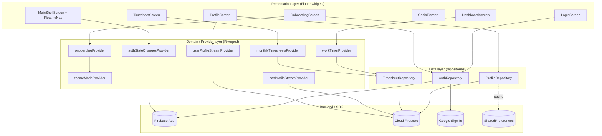

# Architettura

`chigio_time` segue una **clean architecture feature-first**: il codice
e' organizzato per **dominio funzionale** (autenticazione, dashboard,
timesheet, social, profile), e ogni dominio e' suddiviso in tre layer:
`data`, `domain`, `presentation`.

Lo state management e' affidato a **Riverpod 3** con annotazioni
(`@riverpod` → file `*.g.dart`). La navigazione e' centralizzata in un
unico `GoRouter` configurato come provider Riverpod, in modo da poter
osservare reattivamente lo `authStateChanges` di Firebase.

La persistenza remota e' su **Cloud Firestore**, organizzata in una
collezione `users/{uid}` con sub-collezione `timesheets/{YYYY-MM-DD}`.
Sono disponibili (ma non ancora cablati) **Drift** per SQLite locale,
**SharedPreferences** per flag, **flutter_secure_storage** per token.

---

## Diagramma a blocchi

## Sotto-pagine

- [`layering.md`](./layering.md) — convenzioni di cartelle, naming,
  responsabilita' di ciascun layer.
- [`state-management.md`](./state-management.md) — pattern Riverpod usati
  (Notifier, AsyncNotifier, family, code-gen).
- [`navigation.md`](./navigation.md) — struttura del router, guard di
  autenticazione e onboarding, shell con bottom nav.
- [`persistence.md`](./persistence.md) — Firestore (cloud), Drift +
  SharedPreferences + secure storage (locale), strategie di cache.

## Stack runtime

| Categoria | Libreria | Versione (pubspec) |
|---|---|---|
| Framework | Flutter | SDK ^3.10.4 |
| State management | `flutter_riverpod` + `riverpod_annotation` | ^3.1.0 / ^4.0.0 |
| Routing | `go_router` | ^17.0.1 |
| Backend | `firebase_core`, `firebase_auth`, `cloud_firestore`, `firebase_storage`, `firebase_messaging` | 4.x / 6.x / 6.x / 13.x / 16.x |
| Auth provider | `google_sign_in` | ^7.2.0 |
| DB locale | `drift`, `sqlite3_flutter_libs` | ^2.16.0 / ^0.5.20 |
| Storage chiave-valore | `shared_preferences`, `flutter_secure_storage` | ^2.2.3 / ^10.0.0 |
| UI components | `table_calendar`, `fl_chart`, `flutter_slidable`, `badges`, `cached_network_image`, `image_picker`, `percent_indicator`, `google_fonts` | varie |
| Codegen | `build_runner`, `riverpod_generator`, `freezed`, `json_serializable`, `drift_dev` | varie |
