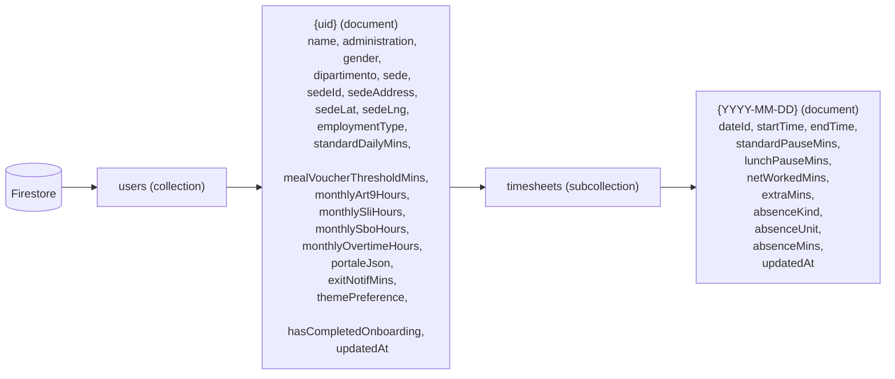

# Persistenza

`chigio_time` usa **persistenza ibrida**: il dato canonico vive su
Cloud Firestore, mentre client locali (preferenze, cache, secure
storage, Drift/SQLite) accelerano i percorsi critici e offrono fallback
offline.

## Cloud — Firestore

- **Convenzione di chiave.** L'ID del documento `timesheet` coincide con
  `dateId = YYYY-MM-DD`. Questo abilita query "per range" usando
  `where('dateId' >= 'YYYY-MM-01' && <= 'YYYY-MM-31')` come fa
  `monthlyTimesheetsProvider`.
- **Update mode.** Tutte le scritture usano `SetOptions(merge: true)`
  per essere idempotenti.
- **Timestamp.** I tempi su `users/{uid}` usano `FieldValue.serverTimestamp()`,
  mentre `DailyTimesheet` serializza `startTime/endTime` come **stringa
  ISO-8601** (`toIso8601String()`). Vedi nota di consistenza piu' sotto.

## Locale

| Tecnologia | Uso attuale | File |
|---|---|---|
| `shared_preferences` | Cache `hasProfile_<uid>` per gating onboarding | `app_router.dart` |
| `flutter_secure_storage` | Riservato a token / credenziali (non ancora usato) | — |
| `drift` (SQLite) | Cache/offline `TimesheetEntries` + tabella `pcm_office_locations` per sedi PCM | `lib/core/database/app_database.dart` |

## Strategie di sincronizzazione

Il timesheet usa un pattern write-through: le scritture principali salvano su
Firestore e mantengono una copia locale Drift per resilienza offline/fallback.
Le sedi PCM vengono seedate localmente se la tabella `pcm_office_locations` è
vuota.

Pattern target ancora aperto:

1. Coda esplicita di sync per scritture fallite offline.
2. Reconciliation con Firestore quando la connessione torna disponibile.
3. Asset web per Drift WASM (`sqlite3.wasm`, worker compilato) integrati nel
   processo di build.

## Note di consistenza dati

- **Tipi temporali misti.** `TimesheetEntry` (modello legacy in
  `shared/models`) usa `Timestamp` Firestore, mentre `DailyTimesheet`
  serializza in stringa ISO-8601. Quando si introdurra' un layer di
  serializzazione unificato (Freezed + `json_serializable`), va
  scelto un solo formato canonico. Vedi nota in
  [`../entities/daily-timesheet.md`](../entities/daily-timesheet.md).
- **`TimesheetEntry` non e' usato** dal codice attivo (vedi nota in
  [`layering.md`](./layering.md)). Va deprecato o ricondotto a un caso
  d'uso (es. log granulare delle timbrature).
- **Schema Firestore** non e' versionato a livello documento: nessun
  campo `schemaVersion`. Quando si introdurra' una migrazione, sara'
  necessario aggiungerlo (potenziale ADR).

_Ultima revisione: 2026-06-07 — aggiornati Drift, sedi PCM locali e campi profilo/timesheet recenti._
