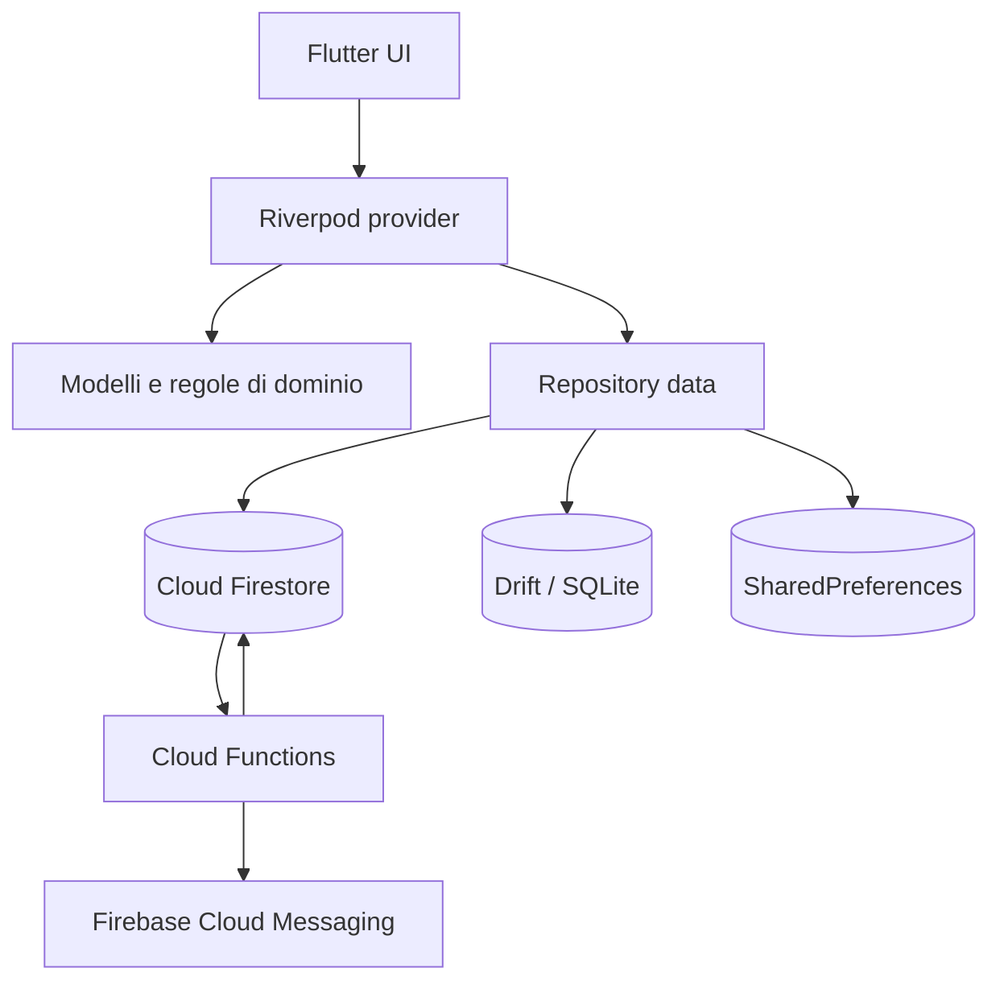

# Architettura

Chigio Time è un client Flutter feature-first con backend Firebase e cache
locale Drift. I confini principali sono:

- **Presentation** — schermate, widget e stato Riverpod.
- **Domain** — modelli e calcoli puri.
- **Data** — repository, Firebase, Drift e servizi di piattaforma.
- **Backend** — Auth, Firestore, Storage, Messaging e Cloud Functions.

## Moduli

| Area | Responsabilità |
|---|---|
| `lib/app/` | bootstrap, router, redirect e tema |
| `lib/core/` | database, servizi, catalogo PCM, failure, logging, costanti e utilità |
| `lib/features/` | funzionalità organizzate per dominio |
| `lib/shared/` | componenti e provider riusabili |
| `functions/` | producer e delivery delle notifiche |
| `scripts/` | migrazioni e manutenzione amministrativa |

Feature attive:

`authentication`, `dashboard`, `timesheet`, `projects`, `social`, `salary`,
`profile`, `chigio`.

## Flussi architetturali critici

### Avvio Web

1. Skeleton HTML durante il caricamento del motore.
2. `runApp` immediato con skeleton Flutter.
3. Firebase, locale, preferenze e font bundled vengono inizializzati.
4. Firestore abilita cache persistente multi-tab.
5. Il gate profilo distingue cache e server.

Vedi [ADR-0014](../decisioni/0014-bootstrap-web-cache-first.md).

### Turno

Il timer usa stato locale per reattività e recovery, Firestore per il sync
cross-device e un handshake basato su metadata/generazioni per evitare
resurrezioni o rollback. A fine turno produce un `DailyTimesheet`.

Vedi [ADR-0017](../decisioni/0017-sincronizzazione-timer-offline.md).

### Notifiche

Ogni evento viene scritto nell’inbox. Un solo backend applica DND, routing,
multi-device e retry prima della consegna FCM.

Vedi [ADR-0012](../decisioni/0012-notifiche-firebase-inbox-first.md).

### Catalogo PCM

Il catalogo segue la catena Firestore valido → Drift → asset bundled. La cache
viene sostituita solo dopo validazione atomica dell’intero payload.

Vedi [ADR-0013](../decisioni/0013-catalogo-pcm-firestore-con-fallback-offline.md).

### Diagnostica ed errori

`AppLog` è l'unico ingresso per la diagnostica e consente di sostituire il
sink. `AppFailure` classifica gli errori tecnici e fornisce messaggi utente
senza esporre eccezioni raw.

Vedi [ADR-0015](../decisioni/0015-logging-e-failure-tipizzate.md).

## Stack

Le versioni esatte sono in `pubspec.yaml` e nei lockfile.

| Categoria | Tecnologia |
|---|---|
| Client | Flutter 3 / Dart 3 |
| Stato | Riverpod 3 |
| Navigazione | go_router |
| Backend | Firebase Auth, Firestore, Storage, Messaging, Functions |
| Cache | Drift + SQLite/WASM, SharedPreferences |
| Test | flutter_test, Node test runner, test contrattuali rules |

## Approfondimenti

- [Layering](./layering.md)
- [State management](./state-management.md)
- [Navigazione](./navigation.md)
- [Persistenza](./persistence.md)
- [Sicurezza](./sicurezza.md)
- [Decisioni architetturali](../decisioni/README.md)

_Ultima revisione: 2026-07-29._
