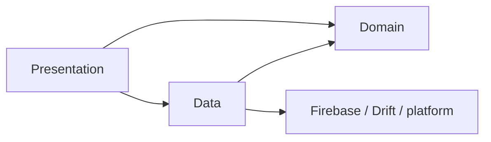

# Layering e organizzazione del codice

## Regola principale

Ogni feature vive in `lib/features/<feature>/` e separa tre responsabilità:

```text
lib/features/<feature>/
├── data/           repository e accesso a servizi esterni
├── domain/         modelli, invarianti e calcoli puri
└── presentation/   schermate, widget e stato UI
```

Non tutte le feature devono riempire artificialmente ogni cartella. Un layer
vuoto è preferibile a un’astrazione senza responsabilità reale.

## Dipendenze consentite



- `domain` non importa Flutter, Firebase o file di presentation;
- `data` non importa presentation;
- presentation usa servizi esterni attraverso repository/provider;
- un widget non accede direttamente a `FirebaseFirestore.instance`;
- il codice cross-feature stabile vive in `core` o `shared`, non in una
  feature scelta arbitrariamente.

## Struttura reale

```text
lib/
├── main.dart
├── firebase_options.dart
├── app/
│   ├── bootstrap/
│   ├── routes/
│   └── theme/
├── core/
│   ├── constants/
│   ├── data/
│   ├── database/
│   ├── errors/
│   ├── logging/
│   ├── services/
│   └── utils/
├── features/
│   ├── authentication/
│   ├── dashboard/
│   ├── profile/
│   ├── projects/
│   ├── salary/
│   ├── social/
│   └── timesheet/
└── shared/
    ├── providers/
    └── widgets/
```

`chigio` è una feature presentation-only. È corretto finché non introduce dati
o regole autonome.

## Stato e repository

- I nuovi provider preferiscono `@riverpod`.
- I repository appartengono a `data/`.
- I calcoli deterministici e testabili appartengono a `domain/`.
- Un Notifier di presentation può orchestrare repository e stato UI, ma non
  deve duplicare parsing o query Firestore.

Esempi:

- `DailyTimesheet.recomputedFromSegments` è logica di dominio;
- `TimesheetRepository` persiste Firestore e Drift;
- `WorkTimer` orchestra azioni e riconciliazione;
- `ActiveTimerRepository` incapsula lo schema remoto.

## Naming

| Elemento | Convenzione | Esempio |
|---|---|---|
| File Dart | `snake_case.dart` | `timer_provider.dart` |
| Classe | `UpperCamelCase` | `DailyTimesheet` |
| Provider | suffisso `Provider` | `profileGateProvider` |
| Repository | `*_repository.dart` | `timesheet_repository.dart` |
| Schermata | `*_screen.dart` | `dashboard_screen.dart` |
| File generato | `*.g.dart` | `app_router.g.dart` |

## Eccezioni e debito

- Alcuni provider manuali precedono il codegen Riverpod corrente: si
  mantengono finché una migrazione produce un beneficio misurabile.
- Alcuni file presentation sono grandi, in particolare Profilo e Timesheet.
  Un’estrazione è valida quando riduce responsabilità o abilita test, non per
  raggiungere una dimensione arbitraria.
- Il timer contiene orchestrazione complessa; le invarianti di sync sono
  documentate in ADR-0017 e non devono essere semplificate senza test di race.

_Ultima revisione: 2026-07-29._
