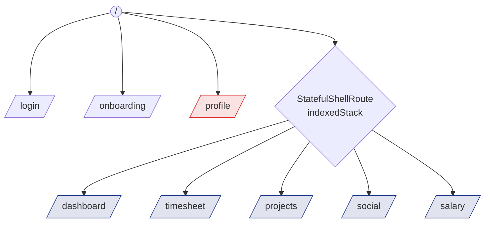
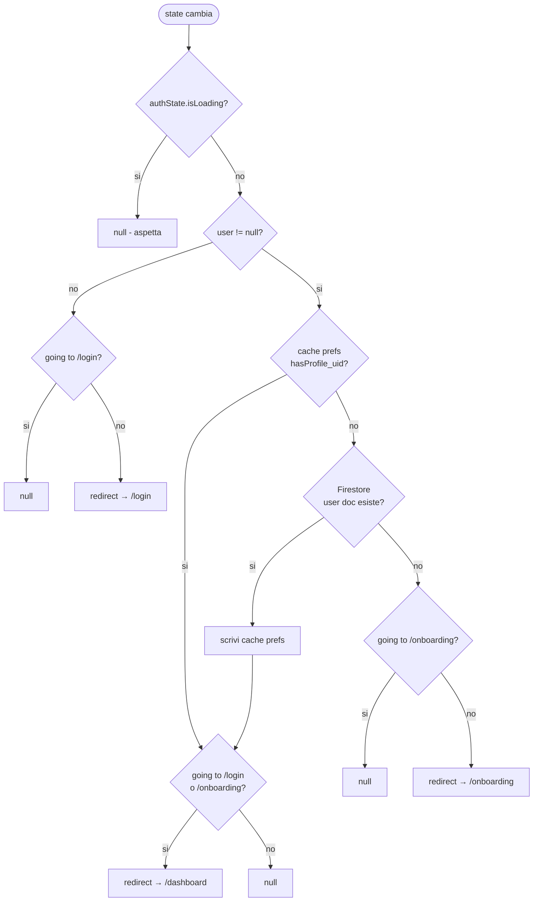

# Navigazione (GoRouter)

Il router e' definito in [`lib/app/routes/app_router.dart`](../../lib/app/routes/app_router.dart)
come provider Riverpod (`appRouterProvider`). Cio' permette al router di
**reagire** ai cambi di `authStateChanges` e di consultare provider
asincroni (es. `hasProfileStreamProvider`).

## Albero delle route



- `/login` e `/onboarding` sono **schermate root**, fuori dalla shell.
- `/profile` e' un **push sopra la shell** (`parentNavigatorKey: _rootNavigatorKey`):
  niente bottom nav visibile.
- Le route autenticate e la shell montano `PcmAssignmentGate` nel proprio
  `builder`, quindi sotto il `Navigator`; login e onboarding restano fuori dal
  gate. Questa posizione è necessaria ai popup dei selettori PCM, che usano
  l'`Overlay` della route.
- Le **5 sezioni principali** (`/dashboard`, `/timesheet`, `/projects`,
  `/social`, `/salary`) vivono in `StatefulShellRoute.indexedStack`, una
  **branch per sezione**. La tab **Progetti** è in 3ª posizione
  ([ADR-0011](../decisioni/0011-pomodoro-progetti.md)); la 4ª storica
  Stipendio in [ADR-0010](../decisioni/0010-stipendio-quarta-tab.md). Per far
  stare 5 voci nella pill su telefoni stretti la larghezza tab in
  `floating_nav.dart` è `64 px` (era 76/88). Le tab sono nascondibili per-voce
  via `hiddenNavViews` (`_navViewKeys` = `home, timesheet, projects, social,
  salary`).
- **Scorciatoie da tastiera (desktop/web, F4):** `MainShellScreen` avvolge il
  contenuto in `CallbackShortcuts` — `1–5` cambiano scheda, `T` → Cartellino,
  `O` → Home, `Esc` → Home, `?` → popup aiuto. Un pulsante "i"
  (`keyboard_rounded`) nell'header desktop apre lo stesso popup.

## Redirect / guard

Logica eseguita ad ogni cambio di rotta:



Punti chiave:
- L'esito viene **memoizzato** in `SharedPreferences` come
  `hasProfile_<uid>: true` per evitare un round-trip a Firestore ad
  ogni avvio.
- Il fallback in caso di errore Firestore e' "nessun profilo" → forza
  l'onboarding.

## Shell con bottom nav

`MainShellScreen` (`lib/shared/widgets/main_shell_screen.dart`) avvolge
le 5 branch in:

- `AppBackground` (gradient) →
- `Column` con `Expanded(navigationShell)` +
  `FloatingNav(currentIndex, onTap)`.

`FloatingNav` riceve `currentIndex` dalla `StatefulNavigationShell` e
chiama `goBranch(i, initialLocation: i == currentIndex)` per gestire il
"back-to-root" quando si ritocca la tab gia' attiva.

---

## Piano di implementazione v0.5

### 1. FloatingNav come overlay — rimozione della riga separatrice

**Problema attuale:** il `Column(Expanded + FloatingNav)` crea un bordo
visivo tra il contenuto delle pagine e la nav bar, interrompendo il
gradiente di `AppBackground`.

**Soluzione:** sostituire il `Column` in `MainShellScreen` con uno `Stack`:

```dart
// MainShellScreen — nuovo layout
AppBackground(
  child: Stack(
    children: [
      Positioned.fill(child: navigationShell),      // contenuto full-screen
      Positioned(
        left: 0, right: 0, bottom: 0,
        child: FloatingNav(currentIndex, onTap),
      ),
    ],
  ),
)
```

Il contenuto delle singole pagine deve aggiungere un `SizedBox` o
`padding bottom` uguale all'altezza della nav (≈ 80 px) per non
essere nascosto dalla pill. Usare `MediaQuery.of(context).padding.bottom`
per il safe-area su iPhone con notch/Dynamic Island.

### 2. Animazione FloatingNav — sliding pill indicator

**Stato attuale:** `AnimatedContainer` cambia solo il colore di sfondo
del tab attivo (180 ms). Nessun movimento visibile tra i tab.

**Soluzione:** convertire `FloatingNav` in `StatefulWidget`, tenere
traccia del tab precedente, e usare `AnimatedAlign` o
`TweenAnimationBuilder<double>` per far scorrere un indicatore/pill
sotto le icone.

Pattern consigliato (pill che scorre orizzontalmente):
```dart
// all'interno di FloatingNav
TweenAnimationBuilder<double>(
  tween: Tween(begin: _prevIndex.toDouble(), end: currentIndex.toDouble()),
  duration: const Duration(milliseconds: 300),
  curve: Curves.easeOutCubic,
  builder: (_, t, __) => Positioned(
    left: _pillLeft(t),   // interpolazione lineare delle coordinate
    child: _PillBackground(),
  ),
)
```

L'animazione è puramente visuale — `onTap` chiama immediatamente
`goBranch` senza aspettare la fine della transizione.

### 3. Breakpoint desktop adattivo

Aggiungere a `lib/app/app.dart` (o `lib/core/constants.dart`):

```dart
const double kAppMaxWidth    = 430.0;  // mobile-first centrato
const double kDesktopBreakpoint = 800.0; // layout split-view
```

Su schermi `>= kDesktopBreakpoint`:
- La vincolo `kAppMaxWidth` viene rimosso in `app.dart` → il contenuto
  si espande a tutta la larghezza disponibile.
- Ogni screen usa `LayoutBuilder` per scegliere tra `_MobileLayout`
  e `_DesktopLayout` (vedi schede feature per i dettagli dei singoli
  split-view).
- `FloatingNav` rimane centrata in basso (layout a pill, invariato).

Modifica in `app.dart`:
```dart
builder: (context, child) {
  final w = MediaQuery.sizeOf(context).width;
  if (w < kDesktopBreakpoint) {
    // mobile: centra a 430 px
    return AppBackground(child: Center(
      child: SizedBox(width: min(w, kAppMaxWidth),
                      height: double.infinity,
                      child: ClipRect(child: child!)),
    ));
  }
  // desktop: full-width, ogni screen gestisce il proprio layout
  return AppBackground(child: child!);
},
```
