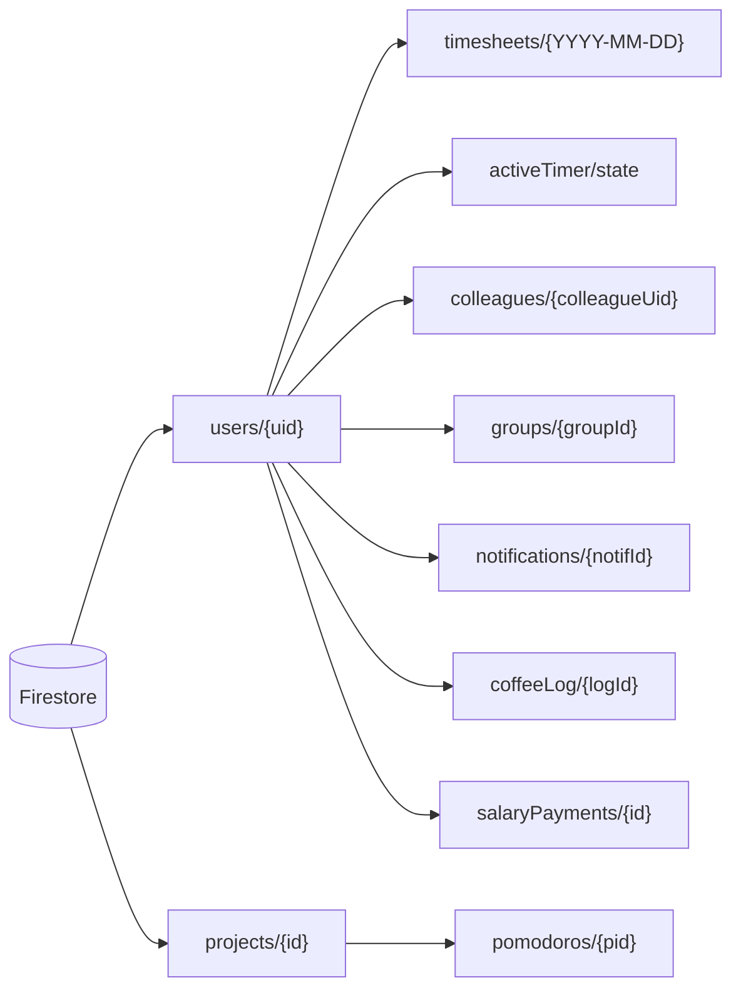

# Persistenza

`chigio_time` usa **persistenza ibrida**:

- **Cloud Firestore** è la sorgente canonica per profilo, timesheet, social,
  notifiche, totalizzatori manuali e timer cross-device.
- **SharedPreferences** conserva preferenze leggere e stato timer mid-day.
- **Drift/SQLite** offre cache locale su piattaforme native e tabella locale
  delle sedi PCM.
- **Firebase Auth** resta la sorgente identitaria: l'ID documento utente è
  sempre `uid`.

Su web Drift gira via `WasmDatabase` (ADR-0005): richiede due asset statici
in `web/` — `sqlite3.wasm` (scaricato dalle release di `sqlite3.dart`,
versione allineata al package `sqlite3` in pubspec) e `drift_worker.dart.js`
(compilato con `dart compile js lib/core/database/drift_worker.dart`). Se
l'init WASM fallisce (asset mancante → "Failed to execute 'compile' on
'WebAssembly'"), `appDatabaseProvider` degrada a `null` e i repository
lavorano Firestore-only.

---

## Firestore

### `users/{uid}`

Documento profilo e preferenze personali. Campi principali:

| Gruppo | Campi |
|---|---|
| Identità | `name`, `administration`, `employmentType`, `gender`, `hasCompletedOnboarding` |
| Struttura PCM | `dipartimento`, `sede`, `sedeId`, `sedeAddress`, `sedeLat`, `sedeLng`, `piano`, `stanza`, `interno`, `phoneNumber` |
| Orario e soglie | `standardDailyMins`, `mealVoucherThresholdMins`, `monthlyArt9Hours`, `monthlySliHours`, `monthlySboHours`, `monthlyOvertimeHours` |
| UI/preferenze | `themePreference`, `summaryItems`, `summaryShowProgress`, `highlightWidget`, `exitNotifMins` |
| Social/notifiche | `currentStatus`, `statusDate`, `coffeeAvailable`, `notifyPayday`, `paydayDay`, `isPrivate` |
| GPS | `gpsAutoClockIn`, `officeLat`, `officeLng`, `officeRadiusM` |
| Audit | `updatedAt` (`FieldValue.serverTimestamp()`) |

> **Attenzione (C1, review 2026-07-05).** Il doc `users/{uid}` è leggibile da
> tutti i colleghi della stessa amministrazione (directory): NON aggiungere
> qui campi sensibili. `portaleJson` (totalizzatori HR) e `fcmToken` sono
> stati spostati in `users/{uid}/private/` (vedi sotto); i campi legacy
> vengono cancellati alla prima scrittura post-migrazione.

Scritture principali:

- `ProfileRepository.saveOnboardingData()` crea/aggiorna il profilo iniziale.
- `ProfileRepository.updateProfileFields()` aggiorna campi puntuali.

### `users/{uid}/private/{docId}` (owner-only)

Sotto-collezione mai leggibile da altri utenti (rules). Documenti:

| Doc | Contenuto | Scrittura | Lettura |
|---|---|---|---|
| `portale` | snapshot manuale totalizzatori portale PA (dati HR: matricola, ferie, straordinari) | `ProfileRepository.savePortaleData()` (batch: set + delete del legacy `portaleJson`) | `privatePortaleStreamProvider` → `portaleRawProvider` (fallback legacy per account non migrati) |
| `fcm` | `{token, updatedAt}` token push del device | `FcmService._saveToken()` (batch: set + delete del legacy `fcmToken`) | Cloud Functions `_getToken()` (fallback legacy) |

### `users/{uid}/timesheets/{dateId}`

Registro giornaliero canonico. `dateId` usa sempre formato `YYYY-MM-DD` ed è
anche ID documento.

Campi principali:

| Gruppo | Campi |
|---|---|
| Orari | `dateId`, `startTime`, `endTime` come stringhe ISO-8601 |
| Pause | `standardPauseMins`, `leavePauseMins`, `lunchPauseMins` |
| Calcoli | `netWorkedMins`, `extraMins`, `sliMins`, `sboMins` |
| Tipo giornata | `workType` (`presence`, `remote`, `leave`, `holiday`) |
| BOE | `bancaOreMins`, `boeSlot` |
| Assenza personale | `absenceKind`, `absenceUnit`, `absenceMins`, `absenceDays`, `periodStart`, `periodEnd`, `quotaYear`, `countsAsSicknessPeriod`, `sensitive`, `personalNote`, `hasDocumentation` |
| Note/audit | `note`, `updatedAt` ISO-8601 client-side |

Scritture:

- `TimesheetRepository.saveDailyTimesheet()` usa batch Firestore:
  salva `timesheets/{dateId}` e, se il giorno è oggi, aggiorna
  `users/{uid}.currentStatus`.
- `saveRemoteWorkDay()` crea una giornata smart working standard.
- `saveNote()` aggiorna solo la nota.
- `deleteDailyTimesheet()` elimina il giorno e aggiorna la cache locale.

### `users/{uid}/activeTimer/state`

Stato volatile del turno attivo, usato per sync cross-device.

Campi:

`date`, `status`, `startTime`, `pauseStart`, `pauseType`,
`stdPauseMins`, `leavePauseMins`, `lunchPauseMins`.

Regole:

- scritto da `_saveToFirestore(TimerState)`;
- letto all'avvio come fallback dopo SharedPreferences;
- ascoltato in realtime da dispositivi secondari;
- cancellato a fine turno o auto-abbandono.

### `users/{uid}/salaryPayments/{id}`

Accrediti stipendiali (cedolini) inseriti manualmente dall'utente. Owner-only,
Firestore-only (nessun mirror Drift). Campi: `date` (`YYYY-MM-DD`, sort key),
`type` (`ordinaria`/`straordinaria`/`buoniPasto`/`altro`), `grossAmount`,
`netAmount`, `note`, `manual`, `createdAt`. Vedi
[`../entita/salary-payment.md`](../entita/salary-payment.md) e
[`../funzionalita/stipendio.md`](../funzionalita/stipendio.md).

### `projects/{id}` e `projects/{id}/pomodoros/{pid}`

Collezione **top-level** (non sotto `users/{uid}`) perché i progetti sono
condivisibili tra utenti (ADR-0011). `projects/{id}`: `name`, `ownerUid`
(capo progetto, trasferibile), `ownerName`, `shared`, `memberUids`,
`colorValue`, `createdAt`. Sub-collezione `pomodoros/{pid}`: `projectId`,
`uid`, `userName`, `dateId`, `focusMins`, `breakMins`, `startedAt`,
`confirmed`. Il timer in corso vive in `users/{uid}/activeTimer/current`
(distinto da `activeTimer/state` del turno). Vedi
[`../entita/progetto.md`](../entita/progetto.md) e
[`../funzionalita/progetti.md`](../funzionalita/progetti.md).

### Social e notifiche

| Path | Uso |
|---|---|
| `users/{uid}/colleagues/{colleagueUid}` | Rubrica personale colleghi; contiene `isFavorite`, `addedAt`. |
| `users/{uid}/groups/{groupId}` | Gruppi personali: `name`, `memberUids`, `createdAt`. |
| `users/{uid}/coffeeLog/{logId}` | Storico inviti caffè inviati. |
| `users/{uid}/notifications/{notifId}` | Inbox utente: inviti caffè, risposte, promemoria uscita, `colleague_added`. |

**Collegamenti reciproci (F1):** le rules vietano di scrivere nei `colleagues`
altrui, quindi `addColleague` aggiunge solo lato mittente e invia una notifica
`colleague_added`; il client del destinatario riconcilia
(`reconcileIncomingConnections`) aggiungendo a sua volta il mittente.
**Profilo privato (F2):** `users/{uid}.isPrivate == true` esclude il profilo
dalla discovery colleghi e dall'aggiunta (filtro **client-side**); i
collegamenti esistenti continuano a vederlo.

Le notifiche sono anche trigger per Cloud Functions:
`functions/index.js` ascolta `onDocumentCreated` su
`users/{recipientUid}/notifications/{notifId}`, legge il token da
`users/{uid}/private/fcm` (fallback legacy `users/{uid}.fcmToken`) e manda
push FCM. Le rules ammettono il create cross-user solo tra utenti della
stessa amministrazione (A3, review 2026-07-05).

**Nota da verificare quando si toccano le notifiche:** mantenere allineati
campi scritti dal client, `firestore.rules` e `_buildNotification()` nella
Cloud Function. In particolare, i promemoria `exit_reminder` devono essere
ammessi dalle rules e gestiti con titolo/body coerenti.

---

## Locale

### SharedPreferences

| Chiave | Uso |
|---|---|
| `hasProfile_<uid>` | Fast path router per decidere `/onboarding` vs shell app. |
| `chigio_themeMode` | Tema persistito: `light`, `dark`, `system`, `auto`. |
| `chigio_locale` | Lingua app (`it`, `en`). |
| `timer_date`, `timer_status`, `timer_startTime` | Ripristino turno attivo del giorno corrente. |
| `timer_stdPauseMins`, `timer_leavePauseMins`, `timer_lunchPauseMins` | Totali pausa del timer. |
| `timer_pauseStart`, `timer_pauseType` | Pausa corrente se l'app viene chiusa mid-pause. |

La cache `hasProfile_<uid>` viene impostata dopo onboarding e dal router quando
il profilo viene trovato su Firestore. Non viene ancora invalidata
esplicitamente al logout.

### Drift/SQLite

`AppDatabase` usa schema version **3** e due tabelle:

| Tabella | Chiave | Uso |
|---|---|---|
| `timesheet_entries` | `(uid, dateId)` | Cache mensile timesheet per fallback offline native. |
| `pcm_office_locations` | `id` | Sedi/strutture PCM seedate da `pcmOfficeSeeds`. |

`timesheet_entries` contiene i campi principali del giorno e BOE:
`startTime`, `endTime`, pause, `netWorkedMins`, `extraMins`, `sliMins`,
`sboMins`, `workType`, `note`, `bancaOreMins`, `boeSlot`, `updatedAt`.

**Limite attuale:** la cache Drift non contiene ancora i nuovi campi
`absence*` P0. Firestore resta completo e canonico; in fallback offline nativo
le causali assenza dettagliate possono non essere disponibili finché non viene
aggiunta una migrazione schema v4.

`pcm_office_locations` viene popolata con `insertAllOnConflictUpdate()` da
`seedPcmOfficeLocationsIfNeeded()`. Se `AppDatabase` è `null` (web o errore),
`PcmLocationsRepository` usa direttamente i seed statici.

### flutter_secure_storage

Dipendenza presente, ma non usata attivamente nello stato corrente. Non
conservare mai token sensibili in `SharedPreferences`.

---

## Flussi di sincronizzazione

### Onboarding

1. `saveOnboardingData(state)` scrive `users/{uid}` con `merge: true`.
2. L'app salva `SharedPreferences['hasProfile_<uid>'] = true`.
3. Il router usa prima la cache locale, poi un get Firestore one-shot come
   slow path.

### Timer live

1. Ogni transizione salva su SharedPreferences.
2. `_saveToFirestore()` aggiorna `activeTimer/state` per sync cross-device.
3. `currentStatus/statusDate` vengono pubblicati sul profilo per la vista
   Social.
4. A fine turno `TimesheetRepository.saveDailyTimesheet()` consolida il
   record giornaliero.

### Timesheet mensile

1. `monthlyTimesheetsProvider` ascolta Firestore con range lessicale su
   `dateId`.
2. Ogni snapshot viene scritto in Drift native con write-through.
3. Se lo stream Firestore fallisce e `AppDatabase` esiste, il repository serve
   la cache locale.

### Totalizzatori portale

`totalizzatoriProvider` legge `portaleRawProvider` (doc privato
`users/{uid}/private/portale`, fallback legacy `users/{uid}.portaleJson`) e lo
parsa in `Totalizzatori`. Se il dato manca o non è valido, restituisce `null`:
niente fixture zero-filled, niente badge verdi finti.

---

## Regole e sicurezza

- `firestore.rules` consente lettura dei profili agli utenti autenticati per
  abilitare social/status.
- Scrittura del documento profilo e delle subcollection personali: owner only.
- Creazione notifiche cross-user: consentita per utenti autenticati con
  payload ristretto.
- `activeTimer`, `timesheets`, `groups`, `coffeeLog`, `colleagues`: owner only.
- Privacy profilo (`isPrivate`): applicata **client-side** (discovery esclude i
  privati, tasto "+" nascosto). NON nelle rules, perché romperebbe le query di
  lista/batch che non filtrano per `isPrivate`.
- `projects` (top-level): lettura ai membri o se `shared`; scrittura del
  progetto al capo; collaboratore può solo unirsi/lasciare (`memberUids`);
  `pomodoros` creabili dal proprio autore, rimovibili da autore o capo.

Quando viene aggiunto un nuovo tipo notifica o una nuova subcollection,
aggiornare insieme:

1. codice client;
2. `firestore.rules`;
3. Cloud Function, se serve push;
4. questa pagina.

---

## Gap noti

| Gap | Impatto | Dove seguirlo |
|---|---|---|
| Drift web disabilitato finché mancano asset WASM | Web usa Firestore-only e fallback seed per sedi | `docs/ROADMAP.md`, ADR-0005 |
| Drift cache senza campi `absence*` | Fallback offline nativo perde dettaglio causale assenza | backlog migrazione schema v4 |
| Nessuna coda sync offline esplicita | Scritture fallite offline non vengono ritentate automaticamente | backlog persistence |
| `hasProfile_<uid>` non invalidato al logout | Possibile redirect iniziale errato su cambio account | backlog auth |
| Timestamp misti (`Timestamp` server e ISO client) | Parsing e ordinamento richiedono attenzione | futura normalizzazione serializzazione |

_Ultima revisione: 2026-06-07 — audit approfondito Firestore, SharedPreferences, Drift native/web, subcollection social/notifiche e gap schema._
