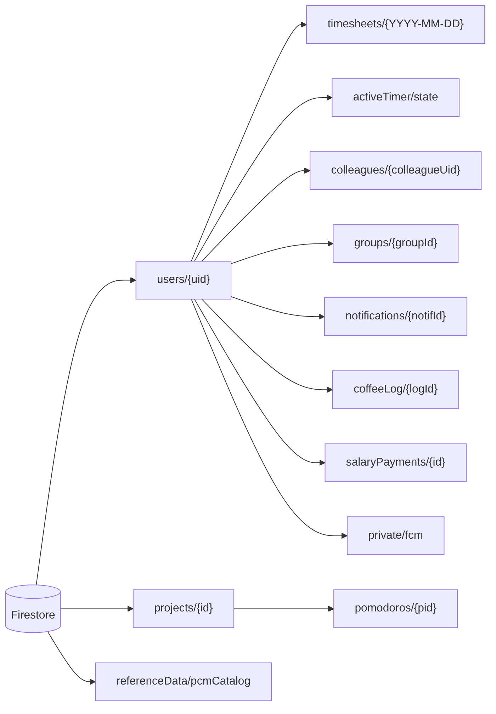

# Persistenza

`chigio_time` usa **persistenza ibrida**:

- **Cloud Firestore** è la sorgente canonica per profilo, timesheet, social,
  notifiche, totalizzatori manuali, timer cross-device e catalogo PCM.
- **SharedPreferences** conserva preferenze leggere e stato timer mid-day.
- **Drift/SQLite** offre cache locale su piattaforme native e tabella locale
  delle sedi PCM.
- **Firebase Auth** resta la sorgente identitaria: l'ID documento utente è
  sempre `uid`.

Su web Drift gira via `WasmDatabase` (ADR-0005): richiede due asset statici
in `web/` — `sqlite3.wasm` (scaricato dalle release di `sqlite3.dart`,
versione allineata al package `sqlite3` in pubspec) e `drift_worker.dart.js`
(compilato con `dart compile js lib/core/database/drift_worker.dart`). Se
l'init WASM fallisce (asset mancante → "Failed to execute 'compile' on
'WebAssembly'"), `appDatabaseProvider` degrada a `null` e i repository
lavorano Firestore-only.

---

## Firestore



### `users/{uid}`

Documento profilo e preferenze personali. Campi principali:

| Gruppo | Campi |
|---|---|
| Identità | `name`, `administration`, `employmentType`, `gender`, `hasCompletedOnboarding` |
| Struttura PCM | `dipartimento`, `sede`, `sedeId`, `sedeAddress`, `sedeLat`, `sedeLng`, `piano`, `stanza`, `interno`, `phoneNumber` |
| Orario e soglie | `standardDailyMins`, `mealVoucherThresholdMins`, `monthlyArt9Hours`, `monthlySliHours`, `monthlySboHours`, `monthlyOvertimeHours` |
| UI/preferenze | `themePreference`, `summaryItems`, `summaryShowProgress`, `highlightWidget` |
| Social | `currentStatus`, `statusDate`, `coffeeAvailable`, `isPrivate` |
| Notifiche | `exitNotifMins`, `doNotDisturb`, `silenceFrom`, `silenceTo`, `notifyMorningColleagues`, `morningColleaguesHour`, `notifyWeeklyRecap`, `weeklyRecapDay`, `weeklyRecapHour`, `monthlyOtAlertHours`, `notifyPayday`, `paydayDay` |
| GPS | `gpsAutoClockIn`, `officeLat`, `officeLng`, `officeRadiusM` |
| Audit | `updatedAt` (`FieldValue.serverTimestamp()`) |

> **Attenzione (C1, review 2026-07-05).** Il doc `users/{uid}` è leggibile da
> tutti i colleghi della stessa amministrazione (directory): NON aggiungere
> qui campi sensibili. `portaleJson` (totalizzatori HR) e `fcmToken` sono
> stati spostati in `users/{uid}/private/` (vedi sotto); i campi legacy
> vengono cancellati alla prima scrittura post-migrazione.

Scritture principali:

- `ProfileRepository.saveOnboardingData()` crea/aggiorna il profilo iniziale.
- `ProfileRepository.updateProfileFields()` aggiorna campi puntuali.
- `administration` è autorità tenant: un doc parziale può inizialmente
  ometterla, il primo valore client ammesso è solo PCM e poi resta immutabile.
  I profili legacy conservano il valore esistente mentre aggiornano altri
  campi. Questo non attesta la membership PCM di un nuovo account: una vera
  authority richiede una futura scelta prodotto server-side (inviti/allowlist
  o equivalente).
- il client non può cancellare il documento profilo: l'eventuale cancellazione
  account/dati deve avvenire server-side, senza riaprire delete+recreate del
  tenant legacy.

### `users/{uid}/private/{docId}` (owner-only)

Sotto-collezione mai leggibile da altri utenti (rules). Documenti:

| Doc | Contenuto | Scrittura | Lettura |
|---|---|---|---|
| `portale` | snapshot manuale totalizzatori portale PA (dati HR: matricola, ferie, straordinari) | `ProfileRepository.savePortaleData()` (batch: set + delete del legacy `portaleJson`) | `privatePortaleStreamProvider` → `portaleRawProvider` (fallback legacy per account non migrati) |
| `fcm` | `installations.{installationId}` con `token`, `platform`, `updatedAt`; `updatedAt` del doc. Fallback temporanei: `token` singolo nel doc e `users/{uid}.fcmToken` | `FcmService` registra/aggiorna l'installazione corrente e cancella il campo pubblico legacy; logout/cambio sessione rimuovono solo la voce corrente | `onNotificationCreated` deduplica i token, invia multicast e rimuove solo quelli definitivamente invalidi |

### `users/{uid}/timesheets/{dateId}`

Registro giornaliero canonico. `dateId` usa sempre formato `YYYY-MM-DD` ed è
anche ID documento.

Campi principali:

| Gruppo | Campi |
|---|---|
| Orari | `dateId`, `startTime`, `endTime` come stringhe ISO-8601 |
| Pause | `standardPauseMins`, `leavePauseMins`, `lunchPauseMins` |
| Calcoli | `netWorkedMins`, `extraMins`, `sliMins`, `sboMins` |
| Tipo giornata | `workType` (`presence`, `remote`, `leave`, `holiday`) |
| BOE | `bancaOreMins`, `boeSlot` |
| Assenza personale | `absenceKind`, `absenceUnit`, `absenceMins`, `absenceDays`, `periodStart`, `periodEnd`, `quotaYear`, `countsAsSicknessPeriod`, `sensitive`, `personalNote`, `hasDocumentation` |
| Note/audit | `note`, `updatedAt` ISO-8601 client-side |

Scritture:

- `TimesheetRepository.saveDailyTimesheet()` usa batch Firestore:
  salva `timesheets/{dateId}` e, se il giorno è oggi, aggiorna
  `users/{uid}.currentStatus`.
- `saveRemoteWorkDay()` crea una giornata smart working standard.
- `saveNote()` aggiorna solo la nota.
- `deleteDailyTimesheet()` elimina il giorno e aggiorna la cache locale.

### `users/{uid}/activeTimer/state`

Stato volatile del turno attivo, usato per sync cross-device.

Campi:

`date`, `status`, `startTime`, `pauseStart`, `pauseType`,
`stdPauseMins`, `leavePauseMins`, `lunchPauseMins`, `reminderAt`,
`reminderLeadMins`; dopo il claim server può comparire `reminderClaimedAt`.

Regole:

- scritto da `ActiveTimerRepository.save(ActiveTimerData)`;
- letto all'avvio come fallback dopo SharedPreferences;
- ascoltato in realtime da dispositivi secondari;
- `reminderAt` è derivato da uscita prevista meno `exitNotifMins`, aggiornato
  quando cambiano turno, pausa o preferenza e rimosso quando non applicabile;
- cancellato a fine turno o auto-abbandono.

### `users/{uid}/salaryPayments/{id}`

Accrediti stipendiali (cedolini) inseriti manualmente dall'utente. Owner-only,
Firestore-only (nessun mirror Drift). Campi: `date` (`YYYY-MM-DD`, sort key),
`type` (`ordinaria`/`straordinaria`/`buoniPasto`/`altro`), `grossAmount`,
`netAmount`, `note`, `manual`, `createdAt`. Vedi
[`../entita/salary-payment.md`](../entita/salary-payment.md) e
[`../funzionalita/stipendio.md`](../funzionalita/stipendio.md).

### `projects/{id}` e `projects/{id}/pomodoros/{pid}`

Collezione **top-level** (non sotto `users/{uid}`) perché i progetti sono
condivisibili tra utenti (ADR-0011). `projects/{id}`: `name`, `ownerUid`
(capo progetto, trasferibile), `ownerName`, `shared`, `memberUids`,
`colorValue`, `createdAt`. Sub-collezione `pomodoros/{pid}`: `projectId`,
`uid`, `userName`, `dateId`, `focusMins`, `breakMins`, `startedAt`,
`confirmed`. Il timer in corso vive in `users/{uid}/activeTimer/current`
(distinto da `activeTimer/state` del turno). Vedi
[`../entita/progetto.md`](../entita/progetto.md) e
[`../funzionalita/progetti.md`](../funzionalita/progetti.md).

### Social e notifiche

| Path | Uso |
|---|---|
| `users/{uid}/colleagues/{colleagueUid}` | Rubrica personale colleghi; contiene `isFavorite`, `addedAt`. |
| `users/{uid}/groups/{groupId}` | Gruppi personali: `name`, `memberUids`, `createdAt`. |
| `users/{uid}/coffeeLog/{logId}` | Storico inviti caffè inviati. |
| `users/{uid}/notifications/{notifId}` | Inbox canonica per eventi sociali, automatici e notifica di prova. |

**Collegamenti reciproci (F1):** le rules vietano di scrivere nei `colleagues`
altrui, quindi `addColleague` aggiunge solo lato mittente e invia una notifica
`colleague_added`; il client del destinatario riconcilia
(`reconcileIncomingConnections`) aggiungendo a sua volta il mittente.
**Profilo privato (F2):** `users/{uid}.isPrivate == true` esclude il profilo
dalla discovery colleghi e dall'aggiunta (filtro **client-side**); i
collegamenti esistenti continuano a vederlo.

Campi comuni dell'inbox:

| Gruppo | Campi |
|---|---|
| Evento | `type`, `title`, `body`, `route`, `sentAt`, `status`, `read` |
| Social opzionali | `fromUid`, `fromName`, `scheduledAt`, `message`, `etaMinutes`, `responseType` |
| Delivery | `pushStatus`, `pushClaimedAt`, `pushClaimAttempt`, `pushDispatchStartedAt`, `pushDispatchTargetCount`, `pushedAt`, `pushError`, `pushOperationalError`, `pushSuccessCount`, `pushFailureCount`, `pushRetryCount` |

Type automatici: `exit_reminder`, `morning_colleagues`, `weekly_recap`,
`overtime_threshold`, `payday`; `test` è creato dall'utente per verificare la
consegna. I type social cross-user restano `colleague_added`, `coffee_invite`
e `coffee_accepted`.

`functions/index.js` ascolta ogni create con `onNotificationCreated`. Il
trigger reclama il documento, applica DND (tranne `test`), risolve una route
allowlisted, invia FCM a tutte le installazioni e chiude `pushStatus` in
`sent`, `suppressed`, `no-token` o `failed`; gli errori transitori ricevono un
retry. Errori di lettura/runtime prima dell'esito restano non terminali e sono
rilanciati a Eventarc; la finalizzazione usa `update` e non ricrea una notifica
cancellata durante la consegna. Errori di cleanup dopo FCM vengono registrati
senza provocare un secondo invio. Per impedire duplicati anche quando entrambe
le finalizzazioni falliscono, il runtime persiste un marker prima di FCM: un
reclaim con marker termina `failed`/`notification/delivery-unknown` senza
reinviare. Un errore marker resta invece pre-FCM e retryable. Windows e Linux
non registrano FCM, ma l'inbox continua a funzionare.

Produttori automatici server-side:

- `hourlyNotifications` (`0 * * * *`, Europe/Rome): colleghi presenti,
  stipendio e recap da lunedì al momento dell'invio; attende tutti gli utenti,
  poi fallisce il job se almeno uno è fallito;
- `exitReminders` (`* * * * *`): query collection-group su
  `activeTimer.reminderAt`, claim transazionale e notifica `exit-{date}`;
  attende tutti i timer prima di propagare un errore;
- `onTimesheetWritten` (`retry: true`): soglia mensile straordinario con ID
  `overtime-{YYYY-MM}`. Gli scheduler hanno `retryCount: 3`; tutti i producer
  restano idempotenti tramite ID deterministici.

**Anti-spam.** Il client mantiene un throttle UX di 60 secondi per
destinatario. La Function rifiuta l'undicesima notifica cross-user nelle 24
ore per la stessa coppia mittente/destinatario, cancellando il documento prima
della push; `setGlobalOptions({maxInstances: 10})` limita la concorrenza. Il
backend corrente non crea nuovi `abuseBans`, ma le rules leggono ancora in
modalità compatibilità eventuali ban creati dalla versione già distribuita e
negano il create finché `until > request.time`. Non esiste un `match` client
sulla collezione. La rimozione del gate richiede prima inventario IAM e cleanup
dei residui live, non verificabili con le credenziali Firebase CLI (REST HTTP
403). Restano inoltre stessa amministrazione, ownership di `fromUid`, schema
specifico per type e limiti: `fromUid`/`fromName` stringa, `sentAt` timestamp,
`read == false`, status corretto, `responseType` enum, `etaMinutes` intero
1–60, `fromName ≤ 60`, `message ≤ 280` e `scheduledAt ≤ 20`.

Mantenere allineati modello `AppNotification`, payload client social,
`firestore.rules`, `notification_logic.js` e `notification_runtime.js`.

---

## Locale

### SharedPreferences

| Chiave | Uso |
|---|---|
| `hasProfile_<uid>` | Fast path router per decidere `/onboarding` vs shell app. |
| `chigio_themeMode` | Tema persistito: `light`, `dark`, `system`, `auto`. |
| `chigio_locale` | Lingua app (`it`, `en`). |
| `timer_date`, `timer_status`, `timer_startTime` | Ripristino turno attivo del giorno corrente. |
| `timer_stdPauseMins`, `timer_leavePauseMins`, `timer_lunchPauseMins` | Totali pausa del timer. |
| `timer_pauseStart`, `timer_pauseType` | Pausa corrente se l'app viene chiusa mid-pause. |
| `timer_pendingRemoteSync` | `true` solo finché una transizione locale attiva non ha ricevuto un echo matching confermato dal server. |
| `timer_clearPending` | Intento di cancellazione persistito prima del delete remoto; protegge il crash window fra delete Firestore e cleanup locale. |

La cache `hasProfile_<uid>` viene impostata dopo onboarding e dal router quando
il profilo viene trovato su Firestore. Non viene ancora invalidata
esplicitamente al logout.

### Drift/SQLite

`AppDatabase` usa schema version **6** e due tabelle:

| Tabella | Chiave | Uso |
|---|---|---|
| `timesheet_entries` | `(uid, dateId)` | Cache mensile timesheet per fallback offline native. |
| `pcm_office_locations` | `id` struttura | Cache delle 50 coppie PCM, con `site_id` stabile. |

`timesheet_entries` contiene i campi principali del giorno e BOE:
`startTime`, `endTime`, pause, `netWorkedMins`, `extraMins`, `sliMins`,
`sboMins`, `workType`, `note`, `bancaOreMins`, `boeSlot`, `updatedAt`.

**Limite attuale:** la cache Drift non contiene ancora i nuovi campi
`absence*` P0. Firestore resta completo e canonico; in fallback offline nativo
le causali assenza dettagliate possono non essere disponibili finché non viene
aggiunta una migrazione schema v4.

`PcmCatalogRepository` tenta nell'ordine il documento
`referenceData/pcmCatalog`, la cache Drift e il payload bundled
`assets/data/pcm_catalog.json`. Un remoto è scritto in cache solo dopo la
validazione completa. `replacePcmCatalog()` sostituisce tutte le righe in una
transazione, quindi una struttura rimossa non resta nella cache. La migrazione
schema 6 aggiunge `site_id`; righe legacy prive del campo vengono ignorate e
causano fallback al bundled.

### flutter_secure_storage

Dipendenza presente, ma non usata attivamente nello stato corrente. Non
conservare mai token sensibili in `SharedPreferences`.

---

## Flussi di sincronizzazione

### Onboarding

1. `saveOnboardingData(state)` scrive `users/{uid}` con `merge: true`.
2. L'app salva `SharedPreferences['hasProfile_<uid>'] = true`.
3. Il router usa prima la cache locale, poi un get Firestore one-shot come
   slow path.

### Timer live

1. Ogni transizione salva su SharedPreferences con
   `timer_pendingRemoteSync: true` prima di avviare la write remota.
2. `ActiveTimerRepository.watch()` ascolta anche i metadata Firestore. Echo con
   write pending o proveniente dalla cache non viene applicato; soltanto un
   echo matching con `hasPendingWrites == false && isFromCache == false`
   rimuove il marker locale.
3. Prima di eliminare `activeTimer/state`, il client persiste
   `timer_clearPending`. Se al riavvio il server restituisce ancora un timer,
   handshake e provider ritentano e attendono un solo delete; il successivo
   `null` completa il cleanup senza resync. Un fallimento recovery conserva il
   marker e riabilita il retry al prossimo evento/riavvio. Un errore del clear
   iniziato nella sessione corrente rollbacka invece marker e guardia.
4. `startTurn`, `startPause` ed `endPause` avanzano una generation comune prima
   di mutare/persistire lo stato. Un ack asincrono precedente non può
   sovrascriverli e ripristina il marker pending se lo aveva già rimosso.
5. `exitReminders` crea l'evento inbox quando `reminderAt` scade; il client non
   produce una seconda notifica one-shot.
6. `currentStatus/statusDate` vengono pubblicati sul profilo per la vista
   Social.
7. A fine turno `TimesheetRepository.saveDailyTimesheet()` consolida il
   record giornaliero.

### Timesheet mensile

1. `monthlyTimesheetsProvider` ascolta Firestore con range lessicale su
   `dateId`.
2. Ogni snapshot viene scritto in Drift native con write-through.
3. Se lo stream Firestore fallisce e `AppDatabase` esiste, il repository serve
   la cache locale.

### Totalizzatori portale

`totalizzatoriProvider` legge `portaleRawProvider` (doc privato
`users/{uid}/private/portale`, fallback legacy `users/{uid}.portaleJson`) e lo
parsa in `Totalizzatori`. Se il dato manca o non è valido, restituisce `null`:
niente fixture zero-filled, niente badge verdi finti.

---

## Regole e sicurezza

- `firestore.rules` consente lettura dei profili agli utenti autenticati per
  abilitare social/status.
- Create/update del documento profilo e scrittura delle subcollection
  personali: owner only; delete profilo negato al client.
- Creazione notifiche cross-user: solo stessa amministrazione, `fromUid`
  uguale all'utente autenticato, type social allowlisted e payload ristretto.
- `activeTimer`, `timesheets`, `groups`, `coffeeLog`, `colleagues`: owner only.
- Privacy profilo (`isPrivate`): applicata **client-side** (discovery esclude i
  privati, tasto "+" nascosto). NON nelle rules, perché romperebbe le query di
  lista/batch che non filtrano per `isPrivate`.
- `projects` (top-level): lettura ai membri o se `shared`; scrittura del
  progetto al capo; collaboratore può solo unirsi/lasciare (`memberUids`);
  `pomodoros` creabili dal proprio autore, rimovibili da autore o capo.

Quando viene aggiunto un nuovo tipo notifica o una nuova subcollection,
aggiornare insieme:

1. codice client;
2. `firestore.rules`;
3. Cloud Function, se serve push;
4. questa pagina.

### Deploy reminder

La query `collectionGroup('activeTimer').where('reminderAt', '<=', ...)`
richiede l'override collection-group versionato in `firestore.indexes.json`.
Il gate di rilascio deve includere esplicitamente:

```bash
firebase deploy --only firestore:rules,firestore:indexes,functions
```

---

## Gap noti

| Gap | Impatto | Dove seguirlo |
|---|---|---|
| Drift web indisponibile per asset/runtime WASM | Il catalogo PCM usa Firestore e poi fallback bundled | ADR-0005 |
| Drift cache senza campi `absence*` | Fallback offline nativo perde dettaglio causale assenza | backlog migrazione schema v4 |
| Nessuna coda sync offline esplicita | Scritture fallite offline non vengono ritentate automaticamente | backlog persistence |
| `hasProfile_<uid>` non invalidato al logout | Possibile redirect iniziale errato su cambio account | backlog auth |
| Timestamp misti (`Timestamp` server e ISO client) | Parsing e ordinamento richiedono attenzione | futura normalizzazione serializzazione |

_Ultima revisione: 2026-07-21 — catalogo PCM remoto con cache Drift atomica._
