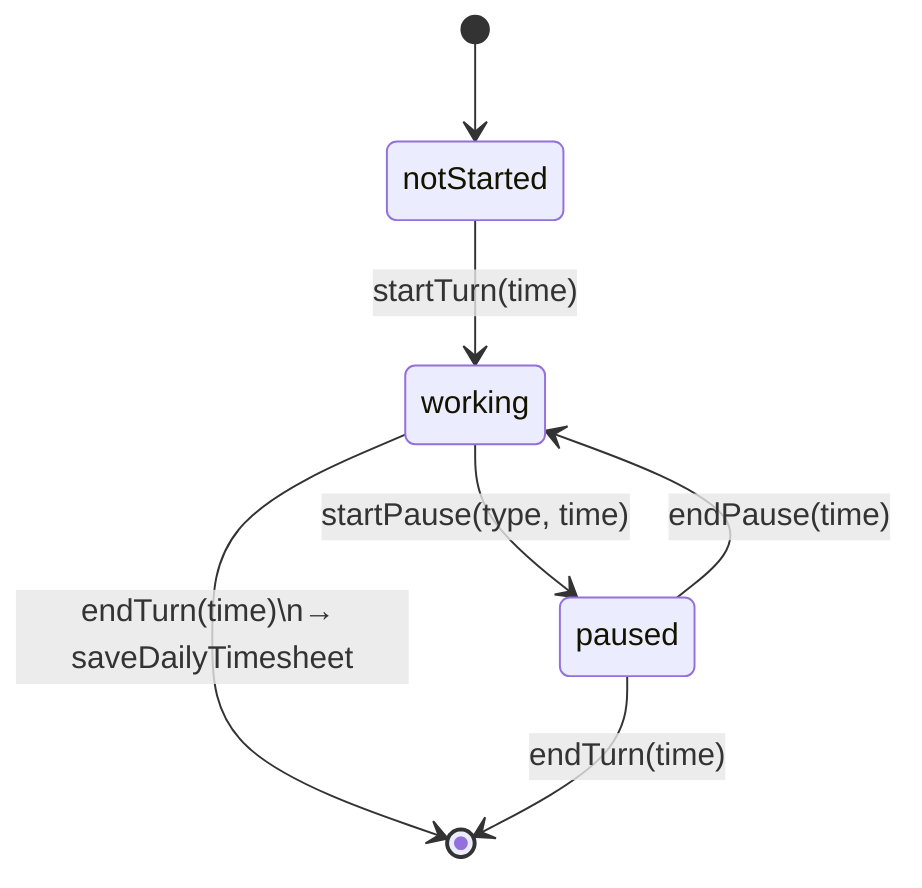

# State management con Riverpod

Lo stato applicativo e' gestito interamente con **Riverpod 3** in
modalita' code-gen (`@riverpod`). I file `*.g.dart` sono **generati** da
`build_runner` (vedi [`../processi/code-generation.md`](../processi/code-generation.md)).

## Tipologie di provider in uso

| Pattern | Esempio nel progetto | File |
|---|---|---|
| `@riverpod` semplice (function-based) | `firebaseAuth(Ref ref)`, `appRouter(Ref ref)`, `timesheetRepository(Ref ref)` | `auth_repository.dart`, `app_router.dart`, `timesheet_repository.dart` |
| `@riverpod` Stream | `authStateChanges`, `hasProfileStream`, `userProfileStream` | `auth_repository.dart`, `profile_repository.dart` |
| `@riverpod` class (Notifier) | `class WorkTimer extends _$WorkTimer`, `class Onboarding extends _$Onboarding` | `timer_provider.dart`, `onboarding_provider.dart` |
| `NotifierProvider` manuale | `themeModeProvider` | `shared/providers/global_providers.dart` |
| `StreamProvider.family` manuale | `monthlyTimesheetsProvider` (chiave `({year, month})`) | `timesheet_repository.dart` |

> **Convenzione.** Quando possibile si usa il code-gen `@riverpod`, ma
> per i `family` con chiave record si usa la dichiarazione manuale per
> evitare di "pesare" i `*.g.dart` (commento esplicito nel codice di
> `monthlyTimesheetsProvider`).

## Lifecycle del WorkTimer (esempio canonico)

- `WorkTimer.build()` crea un `Timer.periodic(1m)` che aggiorna
  `state.currentTime`.
- `endTurn` calcola `netWorkedMins`, `extraMins`, applica la
  **regola delle 9 ore**, poi delega a `TimesheetRepository.saveDailyTimesheet`.
- Dopo il salvataggio lo stato viene resettato a `TimerState(currentTime: now)`.

## Reattivita' del router

Il `GoRouter` e' un provider Riverpod (`appRouterProvider`) che osserva
`authStateChangesProvider`: ad ogni cambio di stato auth, il router
ricostruisce e applica la `redirect`. Vedi
[`navigation.md`](./navigation.md) per il dettaglio.

## Cache & memoizzazione

- I provider Riverpod sono **autoDispose-by-default disabilitato**
  (default Riverpod 3): vivono finche' lo `ProviderScope` esiste.
- Per evitare round-trip extra a Firestore al boot, il router consulta
  `SharedPreferences['hasProfile_<uid>']` **prima** di interrogare
  `hasProfileStreamProvider`. Vedi `app_router.dart`.

## Anti-pattern da evitare

- Leggere `FirebaseAuth.instance` o `FirebaseFirestore.instance`
  direttamente dentro un widget: usare il provider corrispondente
  (`firebaseAuthProvider`, `userProfileStreamProvider`, …).
- Mutare `state` da fuori del Notifier: ogni mutazione deve passare
  per un metodo della classe `extends _$Foo`.
- Mettere `Timer.periodic` in un `initState` di widget: deve stare in
  un Notifier (come `WorkTimer`), che ne gestisce il ciclo di vita.
