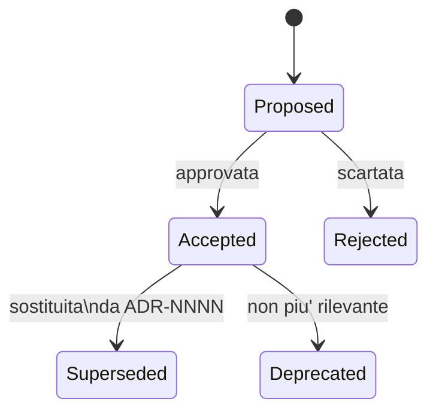

# Architecture Decision Records (ADR)

Le ADR sono note brevi (1–2 pagine) che documentano una **scelta
architetturale non ovvia**: contesto, opzioni, decisione e
conseguenze. Ogni ADR ha un numero progressivo a 4 cifre e uno slug
descrittivo, es. `0042-passa-a-isar.md`.

## Quando aprire una ADR

Vedi anche [`../../CLAUDE.md`](../../CLAUDE.md), §7.

Apri una ADR quando:

- aggiungi/sostituisci una libreria di rilievo (state-management,
  router, ORM, framework di test);
- modifichi lo schema Firestore in modo incompatibile;
- introduci un meccanismo cross-feature (permessi, notifiche,
  multi-tenant, telemetry);
- prendi una decisione "non ovvia" che un futuro lettore potrebbe voler
  rimettere in discussione.

## Ciclo di vita di una ADR

Lo stato e' indicato nell'header della singola ADR (campo `Stato`).

## Indice

| # | Titolo | Stato |
|---|---|---|
| [0000](./0000-template.md) | Template | n/a |
| [0001](./0001-stack-iniziale.md) | Stack iniziale: Flutter + Riverpod + Firebase + Drift | Accepted |
| [0002](./0002-social-groups.md) | Gruppi di colleghi: sub-collezione Firestore per-utente | Accepted |
| [0003](./0003-pdf-csv-packages.md) | Export PDF + Import CSV: `pdf`, `printing`, `file_picker` | Accepted |
| [0004](./0004-gps-geofencing.md) | GPS Geofencing per auto-timbratura: `geolocator` foreground | Accepted |
| [0005](./0005-drift-wasm.md) | Drift su Web via WASM — rimandato | Proposed |
| [0006](./0006-share-plus-file-export.md) | Export file con `share_plus` | Accepted |
| [0007](./0007-banca-ore-esonero.md) | Banca Ore come Esonero (BOE) | Accepted |
| [0008](./0008-firestore-read-scoping.md) | Read-scoping Firestore per amministrazione | Accepted |
| [0009](./0009-cap-periods-storicizzati.md) | Cap di inquadramento storicizzati (effective-dated) | Accepted |
| [0010](./0010-stipendio-quarta-tab.md) | Pagina Stipendio come 4ª tab + sub-collezione `salaryPayments` | Accepted |
| [0011](./0011-pomodoro-progetti.md) | Pomodoro timer su Progetti + collezione top-level `projects` | Accepted |

> Aggiungere una riga ogni volta che si crea una nuova ADR. Mantenere
> l'ordine numerico crescente e linkare il file.

_Ultima revisione: 2026-06-23 — aggiunta ADR-0011 (Pomodoro/Progetti) all'indice._
