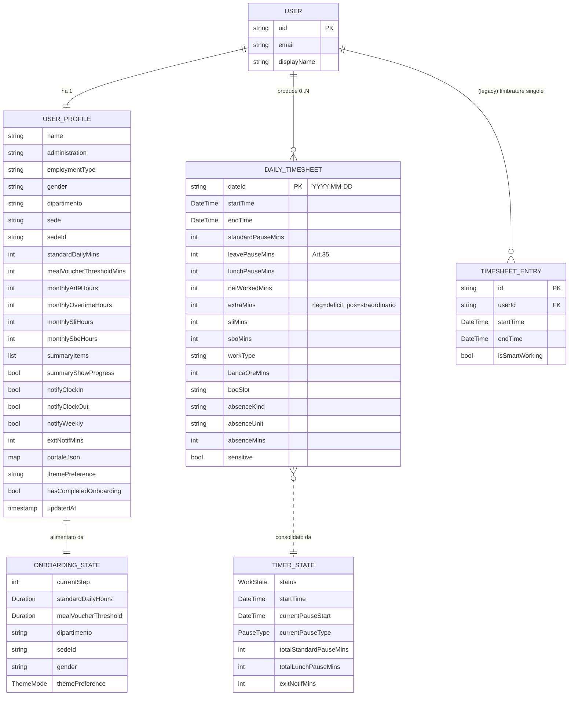

# Modello di dominio (entita')

Questo capitolo raccoglie il **modello concettuale** delle entita' di
`chigio_time` e la loro **mappatura logica → fisica** (Firestore + Drift).

Una scheda per entita' descrive: campi, semantica, regole di validazione,
collocazione nel codice, mappatura sul backend.

## Diagramma ER concettuale

## Mappatura logico → fisico

| Entita' concettuale | Sorgente in `lib/` | Storage canonico | Storage locale |
|---|---|---|---|
| **User** | `firebase_auth` (provider `firebaseAuthProvider`) | Firebase Auth | — |
| **UserProfile** | `lib/features/profile/data/profile_repository.dart` | Firestore: `users/{uid}` | SharedPreferences solo per gating/preferenze leggere |
| **OnboardingState** | `lib/features/authentication/presentation/onboarding_provider.dart` | in-memory (Riverpod Notifier) | persistito in `UserProfile` a fine flow |
| **DailyTimesheet** | `lib/features/timesheet/domain/daily_timesheet.dart` | Firestore: `users/{uid}/timesheets/{dateId}` | Drift native cache parziale (`timesheet_entries`) |
| **TimesheetEntry** *(legacy)* | `lib/shared/models/timesheet_entry.dart` | Firestore (non usato attivamente) | — |
| **TimerState** | `lib/features/dashboard/presentation/timer_provider.dart` | in-memory + Firestore `users/{uid}/activeTimer/state` per sync | SharedPreferences timer mid-day |
| **SalaryPayment** | `lib/features/salary/domain/salary_payment.dart` | Firestore: `users/{uid}/salaryPayments/{id}` | — (Firestore-only) |

## Schede di dettaglio

- [`user-profile.md`](./user-profile.md)
- [`onboarding-state.md`](./onboarding-state.md)
- [`daily-timesheet.md`](./daily-timesheet.md)
- [`timesheet-entry.md`](./timesheet-entry.md)
- [`timer-state.md`](./timer-state.md)
- [`salary-payment.md`](./salary-payment.md)
- [`progetto.md`](./progetto.md) — `Project` + `PomodoroSession` (ADR-0011)

_Ultima revisione: 2026-06-23 — aggiunte entità Project + PomodoroSession (sezione Progetti)._
