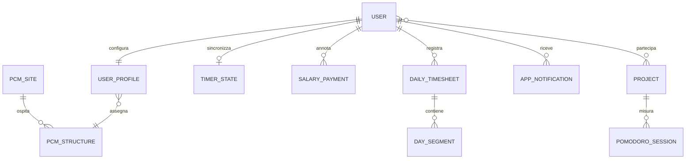

# Modello di dominio

Questa sezione spiega i dati dell'app, dove sono memorizzati e quali regole
non devono essere violate. Firestore è la sorgente remota; Drift mantiene le
copie locali previste dai singoli repository.

## Relazioni principali

```mermaid
erDiagram
    USER ||--|| USER_PROFILE : configura
    USER ||--o{ DAILY_TIMESHEET : registra
    DAILY_TIMESHEET ||--o{ DAY_SEGMENT : contiene
    USER ||--o| TIMER_STATE : sincronizza
    USER ||--o{ SALARY_PAYMENT : annota
    USER }o--o{ PROJECT : partecipa
    PROJECT ||--o{ POMODORO_SESSION : misura
    USER ||--o{ APP_NOTIFICATION : riceve
    PCM_SITE ||--o{ PCM_STRUCTURE : ospita
    USER_PROFILE }o--|| PCM_STRUCTURE : assegna
```

## Catalogo delle entità

| Entità | Codice principale | Storage canonico | Cache locale |
|---|---|---|---|
| [UserProfile](./user-profile.md) | `features/profile/` | `users/{uid}` | preferenze e bootstrap mirati |
| [OnboardingState](./onboarding-state.md) | `features/authentication/` | confluisce in `UserProfile` | stato del flow |
| [DailyTimesheet](./daily-timesheet.md) | `features/timesheet/` | `users/{uid}/timesheets/{dateId}` | Drift `timesheet_entries` |
| `DaySegment` | `timesheet/domain/day_segment.dart` | array `segments[]` del giorno | JSON in Drift |
| [TimerState](./timer-state.md) | `features/dashboard/` | `users/{uid}/activeTimer/state` | SharedPreferences |
| [Project e PomodoroSession](./progetto.md) | `features/projects/` | `projects/{id}` e sessioni utente | nessuna |
| [SalaryPayment](./salary-payment.md) | `features/salary/` | `users/{uid}/salaryPayments/{id}` | nessuna |
| `AppNotification` | `features/social/domain/` | `users/{uid}/notifications/{id}` | stream Firestore |
| [Sedi PCM](./sedi-pcm.md) | `core/data/pcm_catalog.dart` | `referenceData/pcmCatalog` | Drift + JSON bundled |
| [Strutture PCM](./dipartimenti-pcm.md) | `core/data/pcm_catalog.dart` | `referenceData/pcmCatalog` | Drift + JSON bundled |

## Regole invarianti

- Il cartellino giornaliero usa `YYYY-MM-DD` anche come ID Firestore.
- Le pause pranzo e brevi restano campi del giorno; lavoro e permessi orari
  sono segmenti ordinati.
- Un profilo PCM è valido solo se struttura e sede corrispondono al catalogo.
- Lo stato timer locale non è considerato sincronizzato finché Firestore non
  restituisce un acknowledgement server confermato.
- Note e causali sensibili non diventano automaticamente dati condivisi.

Schema e confini di sicurezza sono descritti in
[Persistenza](../architettura/persistence.md) e
[Sicurezza](../architettura/sicurezza.md).

_Ultima revisione: 2026-07-29._
