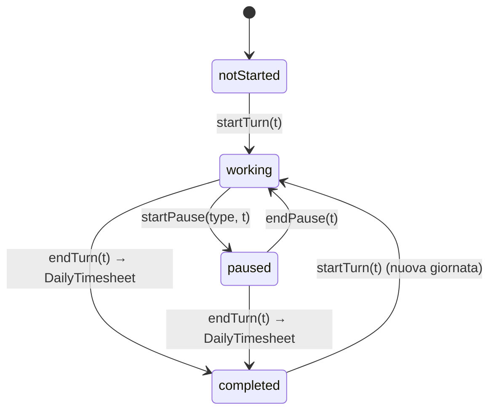

# Entità: `TimerState`

> Stato del cronometro di turno visualizzato in dashboard.
> Persiste su `SharedPreferences` ad ogni transizione e viene ripristinato
> all'avvio se la data salvata è **oggi** (sopravvive ai riavvii mid-day).
> Viene consolidato in un `DailyTimesheet` al termine del turno.

## Definizione

`lib/features/dashboard/presentation/timer_provider.dart`

```dart
enum WorkState { notStarted, working, paused, completed, abandoned }
enum PauseType { none, lunch, short, leave }

class TimerState {
  final WorkState status;
  final DateTime? startTime;
  final DateTime? currentPauseStart;
  final PauseType currentPauseType;
  final int totalStandardPauseMins;   // pause brevi/caffè
  final int totalLeavePauseMins;      // permessi brevi (Art. 35)
  final int totalLunchPauseMins;      // pausa pranzo
  final int standardWorkMins;         // letto da UserProfile.standardDailyMins
  final int exitNotifMins;            // minuti prima uscita prevista; 0 = off
  final DateTime currentTime;         // tick ogni 1 secondo
  final DailyTimesheet? lastCompletedShift; // popolato dopo endTurn()
}
```

## Diagramma di stato



## Calcoli derivati (getter)

| Getter | Formula |
|---|---|
| `expectedExitTime` | `startTime + standardWorkMins + pause brevi + permessi + pranzo + pausa in corso`, più l'eventuale quota forzata da `AppConstants.forcedLunchMins()` (regola 9 ore 3-zone, vedi [daily-timesheet.md](./daily-timesheet.md)) |
| `remainingTime` | `expectedExitTime − currentTime` |
| `exitReminderAt` | se `status == working` e `exitNotifMins > 0`, `expectedExitTime − exitNotifMins`; altrimenti `null` |
| `isShiftActive` | `status == working ∥ status == paused` |

## Persistenza (SharedPreferences)

Chiavi salvate ad ogni transizione:

| Chiave | Tipo | Significato |
|---|---|---|
| `timer_date` | String | `YYYY-MM-DD` del turno attivo |
| `timer_status` | String | `WorkState.name` |
| `timer_startTime` | String | ISO 8601 |
| `timer_stdPauseMins` | int | totale pause brevi/caffè |
| `timer_leavePauseMins` | int | totale permessi brevi (Art. 35) |
| `timer_lunchPauseMins` | int | totale pause pranzo |
| `timer_pauseStart` | String? | ISO 8601 se in pausa |
| `timer_pauseType` | String | `PauseType.name` |

`_loadTimerState()` è chiamato in `WorkTimer.build()`. Se `timer_date ≠ oggi`,
lo stato salvato viene ignorato (stale da ieri).

## Persistenza Firestore e reminder server-side

`ActiveTimerRepository` converte lo stato attivo nel documento
`users/{uid}/activeTimer/state`. Oltre ai dati del turno salva:

| Campo | Tipo | Significato |
|---|---|---|
| `reminderAt` | `Timestamp?` | scadenza derivata da `exitReminderAt`; assente quando reminder disattivato o turno in pausa |
| `reminderLeadMins` | `int` | anticipo configurato (`exitNotifMins`) usato nel copy della notifica |
| `reminderClaimedAt` | `Timestamp?` | audit scritto dalla Function dopo il claim |

La scheduled Function `exitReminders` esegue ogni minuto una query
collection-group su `activeTimer.reminderAt`, reclama in transazione il doc
`state`, rimuove `reminderAt` e crea una sola inbox deterministica
`users/{uid}/notifications/exit-{date}`. Il campo richiede l'indice
collection-group versionato in `firestore.indexes.json` e distribuito con
`firebase deploy --only firestore:indexes`.

Pause, ripresa, cambio orario/soglia e fine turno aggiornano o eliminano il
reminder remoto. Il client non mantiene più un segnale one-shot
`exitReminderPending` e non crea localmente la notifica.

## Sincronizzazione multi-device

`WorkTimer` ascolta `activeTimer/state`. `RemoteTimerHandshake` usa una
generation monotona e un risultato esplicito apply/no-op per impedire che uno
snapshot o un restore asincrono superato sovrascriva un avvio locale più
recente. `ActiveTimerRepository.updateReminder()` aggiorna i soli campi
derivati soltanto se lo stato remoto coincide ancora con quello atteso.

Sul primo snapshot remoto `null`, un turno locale attivo e valido del giorno
corrente non viene cancellato: è ripristinato dalle SharedPreferences e
risincronizzato su Firestore. Questo copre il flusso Web start offline → reload
→ primo snapshot remoto assente. Dopo che almeno uno stato remoto valido è
stato osservato, un successivo `null` resta invece una cancellazione reale e
azzera stato/prefs. La generation scarta entrambi i risultati asincroni se nel
frattempo è avvenuto uno start locale o è arrivato un echo più recente.

## Lifecycle

- `WorkTimer.build()`:
  1. Legge `standardWorkMins` da `userProfileStreamProvider` (Firestore).
  2. Legge `exitNotifMins` dal profilo e lo aggiorna anche durante il turno.
  3. Avvia l'handshake col doc remoto e tenta il ripristino locale senza
     sovrascrivere una transizione più recente.
  4. Avvia un `Timer.periodic(1s)` per aggiornare `currentTime`.
  5. Registra `ref.onDispose(() => _ticker?.cancel())`.
- `endTurn()`: salva `DailyTimesheet` su Firestore, chiama `_clearTimerState()`,
  setta `status = completed` con `lastCompletedShift` compilato.

## Gap risolti in v0.2

- ✅ `_ticker` ora cancellato via `ref.onDispose`.
- ✅ `standardWorkMins` letto da profilo utente con `ref.listen`.
- ✅ Stato `completed` aggiunto: dashboard mostra riepilogo post-turno.
- ✅ Persistenza mid-day su `SharedPreferences`.
- ✅ Tick a 1 secondo (era 1 minuto).
- ✅ `totalLeavePauseMins` aggiunto: permessi brevi tracciati separatamente.
- ✅ `PauseType.leave` → `totalLeavePauseMins` (non più sommato a `standardPause`).
- ✅ `exitNotifMins` configurabile da profilo per promemoria uscita prevista.
- ✅ Reminder uscita persistito come `reminderAt`/`reminderLeadMins` e
  prodotto server-side anche ad app chiusa.
- ✅ Handshake multi-device con generation e apply/no-op contro snapshot
  asincroni superati.

> Nota CCNL 2026-06-06: nel CCNL PCM 2016-2018 i permessi brevi sono Art. 35;
> la label "Art.9" resta per compatibilita' app/portale fino a refactor.

_Ultima revisione: 2026-07-18 — primo null offline-safe, reminder server-side e sync multi-device._
