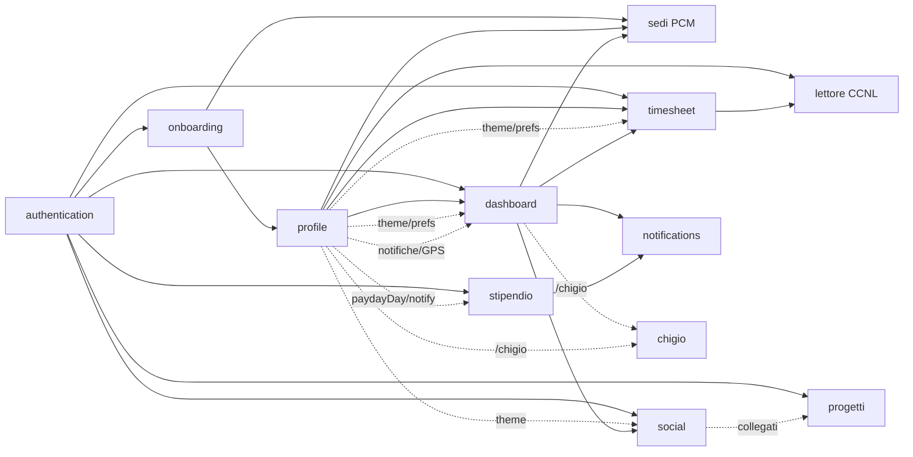

# Mappa delle feature

`chigio_time` è organizzato per **feature funzionali**. Ogni scheda
descrive: obiettivo, file coinvolti, dipendenze cross-feature, stato di
implementazione e gap noti.

## Mappa delle dipendenze

## Schede

- [`authentication.md`](./authentication.md) — Login Google, email/password, reset password, gestione sessione, sign-out.
- [`onboarding.md`](./onboarding.md) — Compilazione profilo iniziale.
- [`dashboard.md`](./dashboard.md) — Cronometro turno, pause, KPI live, widget contatori, totalizzatori portale, percorsi PCM.
- [`timesheet.md`](./timesheet.md) — 3 viste (Lista/Settimana/Mese), alert giornate mancanti, inserimento manuale.
- [`social.md`](./social.md) — Stato colleghi, gruppi, invio caffè.
- [`stipendio.md`](./stipendio.md) — Accrediti stipendiali: prossimo accredito, lordo/netto, storico per tipologia, notifica del giorno (4ª tab).
- [`progetti.md`](./progetti.md) — Pomodoro timer su progetti personali/condivisi, riepiloghi e contributi (3ª tab).
- [`profile.md`](./profile.md) — Dati editabili, statistiche personali, notifiche, widget contatori, tema, lettore CCNL.
- [`chigio.md`](./chigio.md) — Mascotte, quote contestuali e galleria avatar.
- [`chigio-visual-identity.md`](./chigio-visual-identity.md) — Identità visiva, palette, token di design e prompt generativi per tutti i 17 asset (7 esistenti + 10 proposti).
- [`widget-inventory.md`](./widget-inventory.md) — Inventario widget, forze/debolezze e gap trasversali.

## Stato di implementazione (sintesi)

| Feature | Stato | Note |
|---|---|---|
| authentication | ✅ Implementata | Google Sign-In, email/password, registrazione e reset password. |
| onboarding | ✅ Implementata | Profilo minimo PCM con sede da elenco, genere per Chigio e preset orari. |
| dashboard | ✅ Implementata | Widget contatori, preferiti, totalizzatori manuali, route planner sedi PCM. |
| timesheet | ✅ Implementata | 3 viste, alert giornate mancanti, assenze classificate, CSV/PDF. |
| social | ✅ Implementata | Colleghi live da Firestore, gruppi, inviti caffè e filtri cumulativi. |
| stipendio | ✅ Implementata | 4ª tab: prossimo accredito + stima netto, storico per tipologia, notifica del giorno (FCM). Firestore-only. |
| progetti | ✅ Implementata | 3ª tab: Pomodoro timer (preset 25/5, 45/15), progetti personali/condivisi, riepiloghi giorno/sett/mese/sempre, contributi per collega. Firestore-only (ADR-0011). |
| profile | ✅ Implementata | Editabile, statistiche, notifiche, GPS, lettore CCNL e tema persistito. |
| chigio | ✅ Implementata | Quote dedicate, header contestuale, galleria avatar. |
| notifiche push | ✅ Implementata | FCM per notifiche utente e uscita prevista configurabile. |
| storage offline (Drift) | 🟡 Parziale | Write-through e fallback locale; asset WASM web ancora da completare. |

## Feature trasversali non isolate in una sola schermata

| Area | Stato | Pagine/file di riferimento |
|---|---|---|
| Sedi PCM strutturate | ✅ Implementata | Onboarding, Profilo, Dashboard route planner; `core/constants/pcm_locations.dart`, `core/data/pcm_locations_repository.dart` |
| CCNL in app | ✅ Implementata | Profilo → `CCNL PCM`; docs in `docs/ccnl/`; asset Markdown dichiarati in `pubspec.yaml` |
| Assenze personali | 🟡 Fondazione P0 + confronto P1 | `AbsenceKind`, `_EntrySheet`, CSV `assenza_*`, `personalAbsenceConsumptionProvider`; backfill storico e comporto completo in backlog |
| Totalizzatori portale | 🟡 Manuale | `profile.portaleJson`; nessun import HTTP automatico |
| Notifiche | 🟡 Implementate con verifica regole | Coffee/risposte e uscita prevista passano da `users/{uid}/notifications`; mantenere allineati `firestore.rules` e Cloud Function |
| Drift web | 🟡 Parziale | Su web `AppDatabase` è `null` finché mancano `sqlite3.wasm` e worker; su native cache attiva |

## Criteri di aggiornamento

- Se una feature cambia comportamento utente, aggiornare la scheda feature e
  questa sintesi.
- Se cambia schema Firestore/Drift, aggiornare anche
  [`../architecture/persistence.md`](../architecture/persistence.md) e la
  scheda entità coinvolta.
- Se cambia una regola CCNL o una causale assenza, aggiornare
  [`../ccnl/permessi-assenze-congedi.md`](../ccnl/permessi-assenze-congedi.md).

_Ultima revisione: 2026-06-07 — allineato indice feature a sedi PCM, CCNL, assenze P0/P1, notifiche e Drift web._
