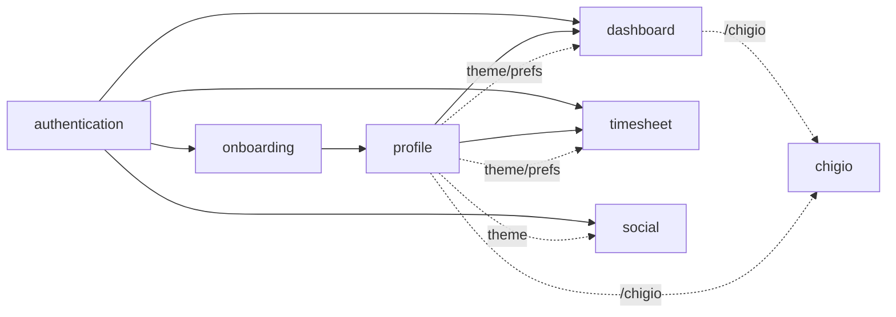

# Mappa delle feature

`chigio_time` è organizzato per **feature funzionali**. Ogni scheda
descrive: obiettivo, file coinvolti, dipendenze cross-feature, stato di
implementazione e gap noti.

## Mappa delle dipendenze

## Schede

- [`authentication.md`](./authentication.md) — Login Google, email/password, reset password, gestione sessione, sign-out.
- [`onboarding.md`](./onboarding.md) — Compilazione profilo iniziale.
- [`dashboard.md`](./dashboard.md) — Cronometro turno, pause, KPI live, widget contatori, totalizzatori portale, percorsi PCM.
- [`timesheet.md`](./timesheet.md) — 3 viste (Lista/Settimana/Mese), alert giornate mancanti, inserimento manuale.
- [`social.md`](./social.md) — Stato colleghi, gruppi, invio caffè.
- [`profile.md`](./profile.md) — Dati editabili, statistiche personali, notifiche, widget contatori, tema, lettore CCNL.
- [`chigio.md`](./chigio.md) — Mascotte, quote contestuali e galleria avatar.

## Stato di implementazione (sintesi)

| Feature | Stato | Note |
|---|---|---|
| authentication | ✅ Implementata | Google Sign-In, email/password, registrazione e reset password. |
| onboarding | ✅ Implementata | Profilo minimo PCM con sede da elenco, genere per Chigio e preset orari. |
| dashboard | ✅ Implementata | Widget contatori, preferiti, totalizzatori manuali, route planner sedi PCM. |
| timesheet | ✅ Implementata | 3 viste, alert giornate mancanti, assenze classificate, CSV/PDF. |
| social | ✅ Implementata | Colleghi live da Firestore, gruppi, inviti caffè e filtri cumulativi. |
| profile | ✅ Implementata | Editabile, statistiche, notifiche, GPS, lettore CCNL e tema persistito. |
| chigio | ✅ Implementata | Quote dedicate, header contestuale, galleria avatar. |
| notifiche push | ✅ Implementata | FCM per notifiche utente e uscita prevista configurabile. |
| storage offline (Drift) | 🟡 Parziale | Write-through e fallback locale; asset WASM web ancora da completare. |
