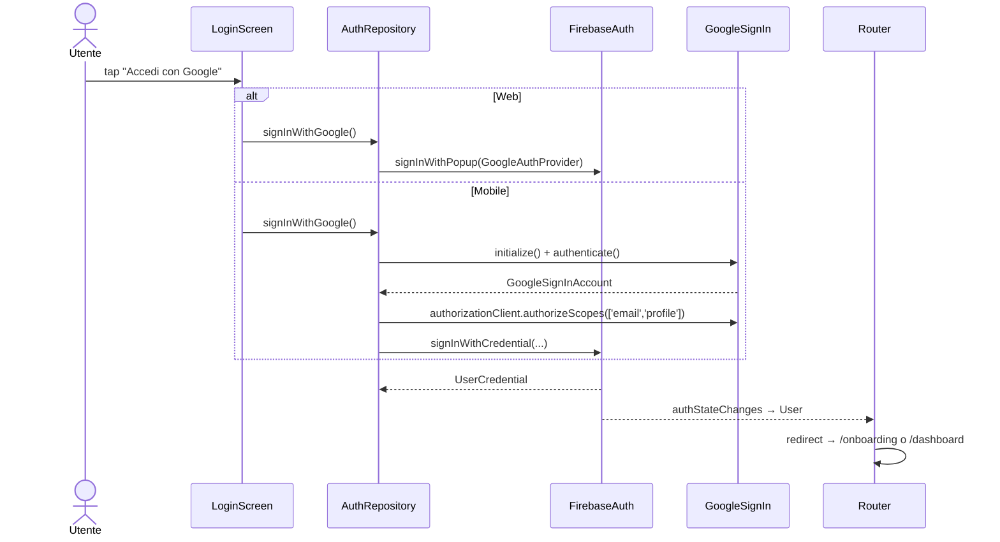
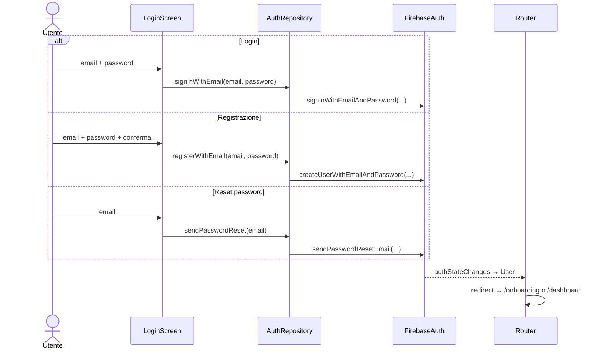

# Feature: Authentication

## Scopo

Permettere all'utente di accedere all'app con Google oppure con
email/password, gestire registrazione/reset password e mantenere lo stato di
sessione reattivo per tutta l'app.

## Requisiti coperti

RF-01, RF-02, RF-03, RF-04 — vedi
[`../00-overview/requirements.md`](../00-overview/requirements.md).

## File coinvolti

| Path | Ruolo |
|---|---|
| `lib/features/authentication/data/auth_repository.dart` | Provider `firebaseAuthProvider`, `authStateChangesProvider`, `authRepositoryProvider`; classe `AuthRepository` con `signInWithGoogle()`, `signInWithEmail()`, `registerWithEmail()`, `sendPasswordReset()`, `signOut()`. |
| `lib/features/authentication/presentation/login_screen.dart` | UI login/registrazione: bottone Google con icona PNG ufficiale, form email, reset password, card centrata con max width 420px. |
| `lib/app/routes/app_router.dart` | Redirect basato su `authStateChanges`. |
| `lib/features/authentication/domain/auth_service.dart` | **Vuoto** (placeholder). |
| `assets/images/google_g_logo.png` | Logo Google usato nel bottone di accesso. |

## UI login

- Il contenitore principale e' vincolato a `maxWidth: 420` sugli schermi
  grandi, quindi non si estende da lato a lato del viewport.
- Il bottone Google usa sfondo bianco, logo `google_g_logo.png` e font
  Roboto, in linea con il branding Google.
- Il motto visualizzato sotto il logo e' `AppStrings.chigioMotto`:
  "Amministrativamente lento, by design."
- Il link "Non hai un account?" resta nel flusso email e porta alla modalità
  registrazione senza nascondere il bottone Google.

## Flusso utente

### Email/password

## Logout

`AuthRepository.signOut()`:
- mobile: `googleSignIn.disconnect()` + `FirebaseAuth.signOut()`;
- web: solo `FirebaseAuth.signOut()`.

## Gap noti

- La `SharedPreferences['hasProfile_<uid>']` **non viene cancellata** al
  logout: se l'utente fa login con un altro account dopo il logout di
  uno con profilo, la prima rotta potrebbe essere errata fino al primo
  refresh. Va aggiunto un cleanup esplicito (issue futura).
- Errori loggati con `debugPrint(...)`: serve un logger strutturato.
- Esiste `lib/features/authentication/domain/auth_service.dart` vuoto:
  o si materializza un `AuthService` che incapsula le regole di
  business, o si rimuove.

_Ultima revisione: 2026-06-07 — aggiunti email/password, reset password, Google button branded e vincolo larghezza login._
