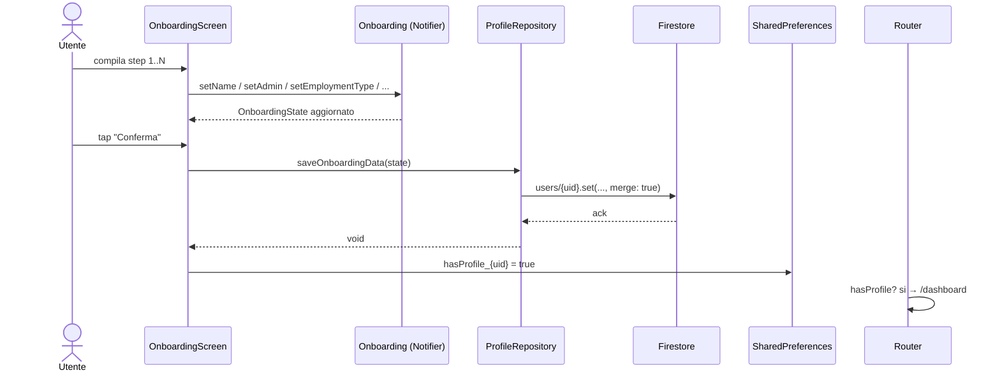

# Feature: Onboarding

## Scopo

Raccogliere il profilo lavorativo dell'utente al primo accesso e
materializzarlo come `UserProfile` su Firestore.

## Requisiti coperti

RF-05, RF-06, RF-07, RF-08.

## File coinvolti

| Path | Ruolo |
|---|---|
| `lib/features/authentication/presentation/onboarding_screen.dart` | UI multi-step. |
| `lib/features/authentication/presentation/onboarding_provider.dart` | `OnboardingState` + Notifier `Onboarding`. |
| `lib/features/profile/data/profile_repository.dart` | `saveOnboardingData(state)` + `hasProfileStreamProvider`. |
| `lib/app/routes/app_router.dart` | Forza `/onboarding` se profilo assente. |

## Diagramma di sequenza

## Default contrattuali

| `employmentType` | `standardDailyHours` | `mealVoucherThreshold` | `monthlyArt9Hours` |
|---|---|---|---|
| `Ruolo` | 7h 36m | 6h 20m | 8 |
| `Comando` | 7h 12m | 6h 20m | 17 |

`administration` ha default *"Presidenza del Consiglio dei Ministri"*.

## Stato attuale & gap

- ✅ Funzionante end-to-end.
- 🟡 Lo stato del Notifier non viene **resettato** dopo il save: e' inerte
  (lo screen viene smontato), ma una `Onboarding.reset()` esplicita
  renderebbe l'API piu' chiara.
- 🟡 `themePreference` viene serializzato come `themePreference.toString()`
  (es. `"ThemeMode.system"`): da deserializzare con un parser
  esplicito quando verra' letto in lettura.
