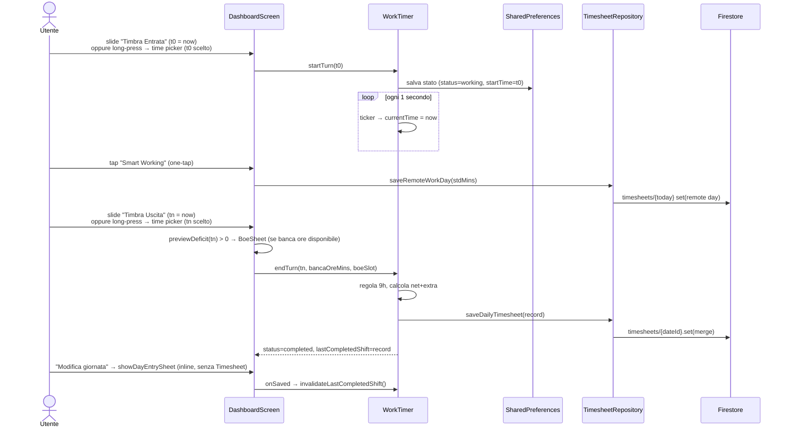
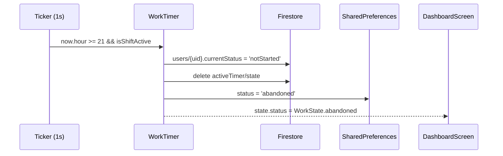

# Feature: Dashboard

## Scopo

Schermata principale: hero di timbratura con Chigio (slide per entrare/uscire ora, long-press per scegliere l'orario, barre di avanzamento, resoconto giornaliero con contatori di maggior presenza e modifica giornata inline), gestione pause, KPI live (uscita prevista, straordinario, buono pasto), widget contatori mensili personalizzabile, totalizzatori portale PA e accesso rapido alla timbratura da remoto.

Il primo caricamento di profilo e mese mostra skeleton; un errore senza dati
precedenti mostra un messaggio umano con `Riprova`. Durante refresh/reload la
Home conserva l'ultimo valore disponibile, evitando il flash di contatori a
zero o giornata apparentemente assente. Il retry globale invalida anche il
gate profilo quando non esiste ancora un valore mensile/profilo utilizzabile.
La skeleton globale riproduce hero, introduzione e prime card con un solo pulse
condiviso; i caricamenti dei singoli widget restano locali e, se esiste già un
valore, refresh e reload continuano a mostrare quel valore.

## File coinvolti

| Path | Ruolo |
|---|---|
| `lib/features/dashboard/presentation/dashboard_screen.dart` | Layout Home: lista widget, nota, GPS card, tabella orari |
| `lib/features/dashboard/widgets/timbratura_hero.dart` | Hero timbratura: saluto+Chigio, slide entra/esci (long-press → picker), barre, resoconto, BOE sheet |
| `lib/features/dashboard/presentation/timer_provider.dart` | `WorkTimer` Notifier + `TimerState` |
| `lib/features/dashboard/presentation/totalizzatori_provider.dart` | Provider dati portale PA da `portaleRawProvider` (private/portale, fallback legacy) |
| `lib/features/dashboard/domain/totalizzatori.dart` | Modello `Totalizzatori` + `TotAlert` + `TotAlertLevel` |
| `lib/features/dashboard/widgets/totalizzatori_section.dart` | `TotAlertBanner`, `BancaOreTile`, `TotalizzatoriSection`, contatori custom |
| `lib/features/dashboard/widgets/favorite_colleagues_card.dart` | Preferiti in Home con quick action caffè/chiama |
| `lib/features/dashboard/widgets/pcm_route_planner_card.dart` | Widget "Percorsi PCM" con stima tempi tra sedi |
| `lib/core/data/pcm_catalog.dart` | Modello delle coppie PCM e aggregazione delle sedi |
| `lib/core/data/pcm_locations_repository.dart` | Repository Firestore/Drift/bundled |
| `lib/shared/widgets/monthly_summary_card.dart` | Widget blu contatori mensili |
| `lib/shared/widgets/day_checkpoints.dart` | Timeline checkpoint giornata |
| `lib/features/timesheet/data/timesheet_repository.dart` | Save `DailyTimesheet` + `saveRemoteWorkDay` |
| `lib/features/profile/data/profile_repository.dart` | `userProfileStreamProvider` per stdMins e KPI |

## Diagramma di sequenza (turno tipo)



## Sezioni UI (mobile)

1. **TimbraturaHero** — card gradiente blu che assorbe il vecchio
   `GlassHeader` (solo in Home): saluto grande "Ciao, {nome}!", frase
   `ChigioPhraseEngine` (tap per cambiarla), campanella notifiche e avatar
   profilo nell'angolo. Sotto: **Chigio grande a sinistra** (posa
   contestuale) e a destra il contenuto della fase corrente (vedi
   "Hero timbratura a 3 fasi"). Nelle altre sezioni dell'app il
   `GlassHeader` resta invariato.
2. **GPS card** (`_GpsPromptCard`) — card autonoma sotto l'hero, solo a
   giornata non iniziata (vedi sezione GPS).
3. **DayCheckpoints** — visibile quando il turno è iniziato.
4. **Preferiti** (`FavoriteColleaguesCard`) — fino a 4 colleghi con azioni rapide caffè/chiama.
5. **Contatori custom Home** (`_HomeCountersRow`) — strip orizzontale con tutti i contatori personalizzati.
6. **Alert banner** (`TotAlertBanner`) — visibile solo se ci sono alert attivi dal portale.
7. **Widget contatori glass** (`MonthlySummaryCard`) — stile glass S-19, voci personalizzabili (default: Art.9 / SLI / SBO / OP), sezione espandibile con Ore tot / Straord / Buoni + barre avanzamento.
8. **Banca ore** (`BancaOreTile`) — totale fruibile con breakdown AC/AP, badge verde se disponibile.
9. **Totalizzatori portale** (`TotalizzatoriSection`) — categorie PA dettagliate (vedi sotto).
10. **Percorsi PCM** (`PcmRoutePlannerCard`) — stima tempi tra sedi PCM e apertura Maps.

## Hero timbratura a 3 fasi (`TimbraturaHero`)

Redesign 2026-07 (sostituisce l'anello `ShiftRing`, eliminato). Chigio
grande è sempre in scena nella colonna sinistra con posa contestuale:
`ciao` (pre-turno) · `timer` (turno attivo) · `caffe` (pausa) · `bavaglino`
(evento buono pasto, 6 secondi) · `corre` (straordinario) · `festeggia`
(completato) · `avviso` (abbandonato).
Tap sulla mascotte → `/chigio`.

### Fase 1 — turno non iniziato

- **Tasto entrata slide-to-confirm** (`_SlideButton`, icona badge): trascina
  il pomello fino a fine corsa (≥90%) per timbrare con l'**ora corrente**.
  **Long-press** sul tasto → time picker → timbra con l'orario scelto.
  Feedback: tick aptici a ogni quarto di corsa, pomello che scala durante il
  drag, `heavyImpact` alla conferma, pomello a fine corsa con **spinner**
  finché il salvataggio è in volo. A riposo il pomello fa un **bounce
  periodico verso destra** (~ogni 2.6s, rientro elastico) che invita allo
  swipe. Nessuno snackbar: il cambio di fase (animato) è il feedback.
- Bottone **Smart Working** sotto il tasto (stile hero, stessa logica
  `saveRemoteWorkDay`).

### Transizioni animate

Le tre fasi sono cross-fadate: `AnimatedSwitcher` (fade + slide) sulla
colonna destra e sulla sezione full-width, `AnimatedSize` ammortizza il
cambio di altezza della card, la posa di Chigio cross-fade con scala.

### Fase 2 — turno attivo (barre + orari in evidenza)

- A destra di Chigio: badge `LIVE`/`IN PAUSA`, contatore lavorato grande,
  orari in evidenza **Entrata → Uscita prevista**.
- **Barra giornata** (`_HeroBars`): riempimento blu→bianco fino alle ore
  standard, prosecuzione **arancione** oltre (straordinario); tick con
  etichette `BP` (soglia buono pasto), orario std e `9h` (tetto CCNL, lo
  span della barra include sempre il gate a 540 min).
- **Barra buono pasto**: barra sottile verde con % → diventa badge
  "🍽️ Buono ✓" al raggiungimento della soglia.
- **Indicatore 9h** (`_HeroNineHourHint`, ex `_NineHourBanner`): ora della
  soglia 9h oppure avviso pausa pranzo virtuale (regola 3 zone).
- **Scenari smart-exit** (`_HeroSmartExit`): Giornaliero / +1h OT /
  Pareggio mese.
- Su desktop l'uscita prevista corrente è duplicata in una pill fissata in
  alto a sinistra, fuori dallo scroll dell'hero. Compare solo con turno attivo
  e resta leggibile mentre si consultano i widget.
- **Chip pause** 🍽️☕🚶 (`_HeroPauseChip`, icona+testo su una riga): **tap**
  avvia la pausa **subito** all'ora corrente; **long-press** apre il time
  picker per un orario custom. In pausa l'hero mostra i **minuti live** (MM:SS,
  arancione) con etichetta "In pausa pranzo/pausa/permesso"; il bottone
  **Riprendi** chiude all'ora corrente (long-press = orario custom).
- **Tasto uscita slide-to-confirm**: slide → timbra con l'ora corrente,
  long-press → time picker; se `previewDeficit > 0` e c'è banca ore apre
  prima il `BoeSheet` (in `timbratura_hero.dart`). Nessuno snackbar:
  correzioni post-uscita via "Modifica giornata" (fase 3).

### Fase 3 — resoconto giornaliero

- A destra di Chigio: badge `✓ COMPLETATO`, netto lavorato grande,
  "Ottimo lavoro" o `+Xh maggior presenza`.
- **Card resoconto** (`_DailySummary`): orari chiave (Entrata / Uscita /
  Lavorato), **contatori maggior presenza di oggi** (totale extra + riparto
  Banca ore SBO / Liquidato SLI quando presenti), dettaglio pause (pranzo,
  pause brevi, permessi — o "Nessuna pausa"), chip buono pasto ✓ e banca
  ore usata.
- Bottone "Modifica giornata" → apre **inline** lo sheet condiviso
  `showDayEntrySheet` (esportato da `timesheet_screen.dart`), senza
  navigare al Timesheet; al salvataggio
  `WorkTimer.invalidateLastCompletedShift()` scarta la copia in-memory e
  l'hero si riallinea allo stream Firestore; alla **cancellazione** della
  giornata `WorkTimer.resetDay()` riporta l'hero alla fase 1 (i contatori
  mensili si aggiornano da soli via `monthlyTimesheetsProvider`, che è uno
  StreamProvider su Firestore).

### Header (campanella + avatar)

`HomeHeaderActions` (pubblico in `timbratura_hero.dart`): su **mobile** vive
nell'header dell'hero come oggi; su **desktop** (`>= 800px`) l'hero lo
nasconde (`showHeaderActions: false`) e il dashboard lo monta in overlay in
alto a destra della pagina (`onHeroGradient: false` per i colori adattivi).

## Widget contatori mensili (`MonthlySummaryCard`)

Carta blu collassabile con voci configurabili dall'utente (via Profilo → Impostazioni → Widget contatori):

- **Header** (sempre visibile): voci selezionate dall'utente in formato `HH:MM` o `—`.
- **Sezione espansa** (tap per aprire): Ore tot / Straord / Buoni + barre di avanzamento per ogni voce.
- `showProgressBars` (bool, default `true`): mostra/nasconde barre.
- `visibleItems` (List<String>, default `['art9','sli','sbo','op']`): voci visibili.

Parametri Firestore letti: `summaryItems`, `summaryShowProgress`, `monthlyArt9Hours`, `monthlySliHours`, `monthlySboHours`, `monthlyOvertimeHours`.

## Stato "Completato"

Dopo `endTurn()` la dashboard entra in `WorkState.completed`: l'hero passa
alla fase 3 (resoconto giornaliero, vedi sopra) con Chigio `festeggia`.

## Smart Working one-tap

Pulsante "Smart Working" sotto il tasto entrata (fase 1 dell'hero). Chiama `TimesheetRepository.saveRemoteWorkDay(stdMins)`:
- Registra giornata con `workType: 'remote'`.
- `netWorkedMins = stdMins` → buono pasto automaticamente maturato.

## Totalizzatori portale PA

Dati del portale modellati in `Totalizzatori`, forniti da `totalizzatoriProvider`.
La sorgente attuale è `users/{uid}/private/portale` (fallback legacy `portaleJson`), compilata/modificata dal
profilo; se il dato non esiste il provider restituisce `null` e la UI mostra
lo stato vuoto. L'import HTTP dal portale PA resta backlog.

Campi chiave:

| Categoria | Chip principali | Alert |
|---|---|---|
| FERIE | Fruito annuo / Spettanza, Residuo ac / Spettanza | amber se residuo AP > 0; red se totali > 30 gg |
| FESTIVITÀ SOPPRESSE | Fruito / Spettanza, Residuo / Spettanza | — |
| STRAORDINARI | Liquidati / Autorizzato, Liquidabili / Autorizzato, Art.9 effettuate, Maggior presenza | amber se maggior presenza > 8h |
| BANCA ORE | Totale fruibile, AC, AP | badge verde se 1h–8h |
| PERMESSI | Ore perse, Permesso breve, Motivi personali, Visita specialistica | badge verde se permesso breve > 20h |
| MALATTIA — periodi (anno) | Periodi, Giorni totali, una chip per periodo (`dataInizio → dataFine`, `N gg`) | mostrata solo se esistono periodi `sickness` nell'anno corrente |
| DEBITI | Ore non recuperate | red se > 0 |

Il badge "Agg. DD/MM/YYYY" in alto a destra della sezione mostra `fetchedAt` (quando i dati sono stati scaricati dal portale).

### Confronto consumo personale (P1, CCNL PCM 2019-2021)

I chip `Permesso breve` / `Motivi personali` / `Visita specialistica` mostrano
una riga secondaria "App: Xh su Yh (anno)" col consumo personale tracciato
dalle entries `leave` (somma `absenceMins` per `absenceKind` nell'anno
corrente), calcolato da `personalAbsenceConsumptionProvider` →
`computeAbsenceConsumption()` (`lib/features/timesheet/domain/absence_consumption.dart`).
I plafond di riferimento sono in `AbsencePlafonds` (38h `short_leave`, 18h
`personal_family_hourly`, 18h `specialist_visit`); la riga diventa ambra se il
plafond personale e' superato. La sezione "MALATTIA — periodi" raggruppa i
giorni consecutivi `absenceKind == sickness` in `SicknessPeriod`. Il confronto
e' solo informativo: il portale resta sorgente di verita', nessuna scrittura
o sincronizzazione bidirezionale. Vedi tabella "Integrazione con totalizzatori"
in [`docs/ccnl/permessi-assenze-congedi.md`](../ccnl/permessi-assenze-congedi.md).

## Percorsi PCM

`PcmRoutePlannerCard` appare in fondo alla Home e usa
`pcmSiteLocationsProvider` per leggere le sedi PCM aggregate per indirizzo.

Caratteristiche:

- 50 coppie canoniche aggregate in 12 sedi fisiche.
- Firestore `referenceData/pcmCatalog`, cache Drift
  (`pcm_office_locations`) e fallback bundled validato.
- Dropdown "Da" / "A", tasto inverti percorso e modalità: a piedi, bici,
  auto/navetta.
- Stima locale con distanza Haversine, fattore percorso e velocità medie per
  modalità; per tratte fuori Roma mostra avviso di stima orientativa.
- Pulsante "Maps" che apre Google Maps con origine, destinazione e travel mode.

## Preferiti e contatori Home

- `FavoriteColleaguesCard`: mostra fino a 4 colleghi preferiti; tap su avatar
  apre sheet con "Manda caffè" e "Chiama" se disponibili.
- `_HomeCountersRow`: mostra tutti i `CustomCounter` dell'utente in chip
  orizzontali, prima del `MonthlySummaryCard`.

## Persistenza mid-day

`WorkTimer` salva lo stato su `SharedPreferences` ad ogni transizione. Al
riavvio dell'app, se `timer_date == oggi`, lo stato viene ripristinato con turno
in corso, pause e orario di entrata corretti. Il flag
`timer_pendingRemoteSync` resta attivo fino a un echo matching confermato dal
server: snapshot locali pending o da cache non possono confermare, sovrascrivere
o resuscitare il turno. Fine turno/reset persistono `timer_clearPending` prima
del delete remoto, così un crash prima del cleanup locale viene completato dal
successivo `null` server senza risincronizzazione. Se il crash avviene prima
del delete e il server restituisce ancora il timer, il provider ritenta un solo
delete awaited e conserva l'intento in caso di errore. Start, pausa e ripresa
avanzano una generation comune prima della mutazione: ack asincroni precedenti
non possono ripristinare lo stato vecchio né cancellare il marker nuovo.

## Nota attività giornaliera

Quando il turno è **completato** (timer → `completed`, oppure giornata già presente su Firestore dopo riavvio — incluso smart working), compare sotto il ring la sezione **"📝 Nota attività"**:

- Textarea multiline (max 500 caratteri).
- Bottone **Salva** → chiama `TimesheetRepository.saveNote(dateId, text)` → `merge: true` su Firestore.
- Conferma visiva "Salvata ✓".
- Il testo è pre-popolato dalla nota già salvata (`DailyTimesheet.note`).

La nota è visibile nel timesheet (lista/settimana/mese) sotto le informazioni orario di ogni giornata.

## Stato "Abbandonato" (auto-abbandono alle 21:00)

Se l'utente non ha timbrato l'uscita entro le 21:00, il timer rileva la condizione `isShiftActive && now.hour >= 21` e chiama `_autoAbandon()`:

1. **Rimozione da "In ufficio"**: pubblica `currentStatus = notStarted` su `users/{uid}.currentStatus` su Firestore → i colleghi non vedono più l'utente come presente.
2. **Pulizia timer Firestore**: cancella `users/{uid}/activeTimer/state`.
3. **Persistenza warning**: salva `status = abandoned` su SharedPreferences → l'avviso sopravvive ai riavvii dell'app.

### UI nello stato `abandoned`

- **Badge arancione** `⚠ INCOMPLETO` nella colonna destra dell'hero + ore lavorate calcolate al cut-off delle 21:00 (non al momento attuale); Chigio in posa `avviso`.
- **CTA `_HeroAbandonedCta`** (card arancione a tutta larghezza nell'hero):
  - **"Registra uscita"** (`GlassBtn`) → apre time picker e chiama `endTurnFromAbandoned(selectedTime)` → delega a `endTurn()`.
  - **"Ignora giornata"** (testo secondario) → chiama `dismissAbandoned()` → resetta a `notStarted` senza salvare.

### Calcolo ore in stato abandoned

```dart
final cutoff = DateTime(start.year, start.month, start.day, 21, 0);
final ref2 = currentTime.isBefore(cutoff) ? currentTime : cutoff;
workedMins = (ref2.difference(start).inMinutes - pauseMins).clamp(0, 9999);
```

### Sequenza `_autoAbandon`



## Widget in evidenza (`_buildHighlightWidget`)

Card colorata opzionale mostrata **sopra** `MonthlySummaryCard` nella sezione stats. Controllata da `profileData['highlightWidget']`:

| Valore | Dato | Colore |
|---|---|---|
| `none` | — (assente) | — |
| `bankHours` | `Totalizzatori.totaleBancaOreFruibile` (min → `Xh YYm`) | Blu |
| `overtime` | Somma `extraMins > 0` del mese corrente | Arancione |
| `mealCount` | Count giornate con `netWorkedMins ≥ mealThreshold` | Verde |

Impostazione in Profilo → "Widget in evidenza" (`_showHighlightWidgetPicker`).

## Tabella orari (`_OrariTableSheet`)

Bottom sheet richiamabile dal link in fondo alla lista Home. Mostra le combinazioni entrata/uscita per 3 modalità contratto, ordinate **ascending**:

| Modo | Minuti | Label |
|---|---|---|
| 0 | 372 | 6:12 |
| 1 | 400 | 6:40 |
| 2 | 456 | 7:36 |

Righe generate da 07:30 con step 15 min, fino a `entry + shiftMins ≤ 21:00`. Colonne: Entrata · Uscita std · Soglia 9h · +30' pranzo. Valori `—` quando > 21:00.

## Reminder uscita server-side

`TimerState.exitReminderAt` calcola l'uscita prevista meno `exitNotifMins`
(0/5/10/15/30; `0` disattiva). `ActiveTimerRepository` salva
`reminderAt` e `reminderLeadMins` in `users/{uid}/activeTimer/state` e li
ricalcola su avvio, pausa, ripresa e cambio preferenza.

La Function `exitReminders` interroga ogni minuto il collection group
`activeTimer`, reclama la scadenza in transazione e crea l'inbox deterministica
`notifications/exit-{date}` con type `exit_reminder`. La consegna passa poi dal
trigger inbox-first comune, quindi funziona anche ad app chiusa, rispetta DND
e raggiunge tutte le installazioni registrate. Il ticker Flutter aggiorna solo
la UI: non emette una seconda notifica locale.

Il flusso richiede l'indice `activeTimer.reminderAt` in
`firestore.indexes.json`; il deploy deve includere `firestore:indexes`.

## GPS auto-timbratura (`_GpsPromptCard`)

Card autonoma mostrata subito sotto l'hero quando:
- `isNotStarted == true`
- `profileData['gpsAutoClockIn'] == true`
- `officeLat` e `officeLng` impostati
- Ora: 06:00–11:00

Tap su "Rileva" → `GeofencingService.checkInOffice()` → dialog conferma se inside → `notifier.startTurn(DateTime.now())`. Richiede permesso `ACCESS_FINE_LOCATION` (Android) / `WhenInUse` (iOS). Vedi **ADR-0004**.

## Widget Home (S-19)

Tutti i widget ordinabili condividono `HomeWidgetHeader`
(`shared/widgets/home_widget_header.dart`): contenitore 36×36 con mini-Chigio
contestuale, titolo grande e sottotitolo/trailing — stile "Percorsi PCM".
Un widget **flaggato visibile ma senza dati** non sparisce: mostra
`HomeWidgetEmpty` (messaggio + CTA). Nuovi widget:

- **Tabella orari** (`OrariTableCard`) — non più uno sheet: entrata → uscita
  std / soglia 9h / 9h30+pranzo. La variante (6:12 / 6:40 / 7:36) è
  preselezionata da `AppConstants.stdMinsForDate` per il giorno corrente, con
  selettore per cambiarla.
- **Pomodoro** (`PomodoroCard`) — timer in corso (countdown + barra + fase)
  oppure avvio rapido 25/5 · 45/15 sull'ultimo progetto; tap → `/projects`.
- **Stipendio** (`SalaryCard`) — countdown al prossimo accredito + stima netto
  dagli ultimi 3 ordinari; tap → `/salary`.

**Default nuovi account**: solo la timbratura (tutti i widget nascosti via
`hiddenHomeWidgets` all'onboarding) + card CTA "Aggiungi widget" che apre il
pannello `showHomeWidgetsPanel`. Se sono visibili **più widget**, in fondo
alla Home c'è un link centrale **"Modifica widget"** (`tune`) che riapre lo
stesso pannello. I widget che linkano a una pagina dedicata (Pomodoro,
Stipendio) mostrano una **freccia "apri"** a destra dell'header
(`HomeWidgetHeader.hasOpenLink`).

## Widget in evidenza e mini-Chigio

- I widget ordinabili della Home rispettano `featuredHomeWidgets` (★ dallo
  sheet "Widget e visibilità" del profilo): il widget viene avvolto in
  `_FeaturedWidget` — stile **«Aurora»**: base blu notte (`#0A1226`) con 3
  blob radiali blu/verde/viola (`_AuroraPainter`), velo glass, shine e bordo
  conico iridescente statici. Non usa ticker né repaint continuo. `Theme` dark
  è forzato sulla card sopra la base, il cui contrasto bianco/base è coperto da
  test WCAG AAA.
- Ogni widget ha un **mini-Chigio** contestuale nell'header (`ChigioMini`,
  `lib/shared/widgets/chigio_mini.dart`).

_Ultima revisione: 2026-07-21 — uscita desktop persistente e Aurora statica._
