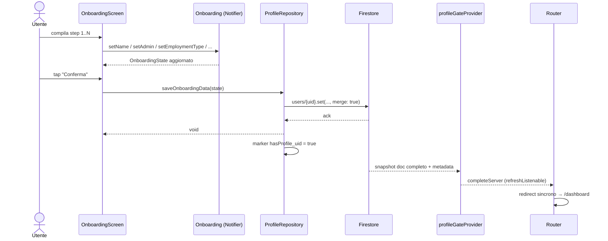

# Feature: Onboarding

## Scopo

Raccogliere il profilo lavorativo dell'utente al primo accesso e
materializzarlo come `UserProfile` su Firestore.

## Requisiti coperti

RF-05, RF-06, RF-07, RF-08.

## File coinvolti

| Path | Ruolo |
|---|---|
| `lib/features/authentication/presentation/onboarding_screen.dart` | UI multi-step. |
| `lib/features/authentication/presentation/onboarding_provider.dart` | `OnboardingState` + Notifier `Onboarding`. |
| `lib/features/profile/data/profile_repository.dart` | `saveOnboardingData(state)` + stream metadata-aware `profileGateProvider`. |
| `lib/features/profile/domain/profile_gate.dart` | Stati tipizzati e reducer puro cache/server/error. |
| `lib/app/routes/app_router.dart` | Forza `/onboarding` se profilo assente. |
| `lib/shared/widgets/pcm_assignment_form.dart` | Selettore canonico Dipartimento/Struttura e sede. |
| `lib/shared/widgets/pcm_assignment_gate.dart` | Riallineamento mirato dei profili PCM legacy. |

## Diagramma di sequenza

### Gate del profilo (reattivo)

Il router non esegue `Firestore.get()` dentro `redirect`. Il gate è guidato da
`profileGateProvider`, che conserva provenienza e usabilità del profilo:

- `_RouterNotifier` tiene una `ref.listen` permanente su
  `authStateChangesProvider` **e** `profileGateProvider`. Il router e'
  `keepAlive`, quindi lo stream (auto-dispose) non viene mai smontato a meta'
  e ogni emissione ri-valuta il redirect.
- `redirect` e' **sincrono**: legge i due provider e decide. Niente
  `async/await`, niente race fra emissioni di auth concorrenti, nessun rimbalzo
  a `/onboarding` di un utente appena onboardato.
- Marker positivo o cache completa → Home disponibile subito.
- Cache incompleta → `resolving`; loading ed errore non forzano redirect.
- Solo snapshot server incompleto/assente → rimozione marker e onboarding.
- Lo stream richiede `includeMetadataChanges: true`; un errore conserva
  l'eventuale profilo utilizzabile e non viene ridotto a “utente nuovo”.

> Il marker locale è positive-only: accelera la Home ma non è mai sufficiente
> per scegliere onboarding. La decisione è formalizzata in ADR-0014.

## Default contrattuali

| `employmentType` | `standardDailyHours` | `mealVoucherThreshold` | `monthlyArt9Hours` |
|---|---|---|---|
| `Ruolo` | 7h 36m | 6h 20m | 8 |
| `Comando` | 7h 12m | 6h 20m | 17 |

`administration` è fissata a *"Presidenza del Consiglio dei Ministri"*, unica
amministrazione oggi abilitata. Le rules accettano documenti parziali creati
prima dell'onboarding senza il campo, ma al primo set consentono solo PCM; dopo
il salvataggio il valore diventa immutabile. Profili legacy di altre
amministrazioni mantengono il proprio valore e possono aggiornare gli altri
campi senza cambiarlo. Questa scelta mantiene l'onboarding attuale, ma non
attesta che un nuovo account appartenga davvero a PCM: il relativo gate
richiede una futura scelta prodotto server-side (invito/allowlist o
equivalente).

## Dipartimento/Struttura e sede

L'ultimo step richiede entrambi i campi. Le 50 strutture e le 12 sedi arrivano
da `pcmCatalogProvider`; la sede associata è ordinata per prima e marcata come
consigliata, ma resta vuota finché l'utente non la seleziona.

Per i profili già completati, `PcmAssignmentGate` è un overlay non
dismissibile applicato sopra il router: compare solo per PCM quando
`dipartimento` o `sedeId` non appartengono al catalogo e salva esclusivamente
i sei campi della coppia PCM, senza ripetere l'onboarding.

## Stato attuale & gap

- ✅ Funzionante end-to-end.
- 🟡 Lo stato del Notifier non viene **resettato** dopo il save: e' inerte
  (lo screen viene smontato), ma una `Onboarding.reset()` esplicita
  renderebbe l'API piu' chiara.
- 🟡 `themePreference` viene serializzato come `themePreference.toString()`
  (es. `"ThemeMode.system"`): da deserializzare con un parser
  esplicito quando verra' letto in lettura.

_Ultima revisione: 2026-07-22 — gate profilo tipizzato e server-authoritative._
