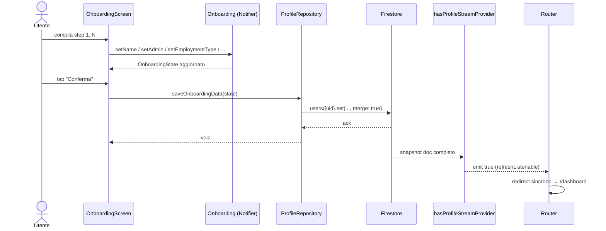

# Feature: Onboarding

## Scopo

Raccogliere il profilo lavorativo dell'utente al primo accesso e
materializzarlo come `UserProfile` su Firestore.

## Requisiti coperti

RF-05, RF-06, RF-07, RF-08.

## File coinvolti

| Path | Ruolo |
|---|---|
| `lib/features/authentication/presentation/onboarding_screen.dart` | UI multi-step. |
| `lib/features/authentication/presentation/onboarding_provider.dart` | `OnboardingState` + Notifier `Onboarding`. |
| `lib/features/profile/data/profile_repository.dart` | `saveOnboardingData(state)` + `hasProfileStreamProvider`. |
| `lib/app/routes/app_router.dart` | Forza `/onboarding` se profilo assente. |

## Diagramma di sequenza

### Gate del profilo (reattivo)

Il router **non** legge piu' una cache `SharedPreferences` ne' fa una
`Firestore.get()` asincrona dentro `redirect`. Il gate e' guidato da
`hasProfileStreamProvider` (unica fonte di verita', vedi
`profileDocIsComplete`):

- `_RouterNotifier` tiene una `ref.listen` permanente su
  `authStateChangesProvider` **e** `hasProfileStreamProvider`. Il router e'
  `keepAlive`, quindi lo stream (auto-dispose) non viene mai smontato a meta'
  e ogni emissione ri-valuta il redirect.
- `redirect` e' **sincrono**: legge i due provider e decide. Niente
  `async/await`, niente race fra emissioni di auth concorrenti, nessun rimbalzo
  a `/onboarding` di un utente appena onboardato.
- `loading` → nessun redirect forzato (evita il flash di onboarding prima che
  la cache/server risponda). `error` (rete/permessi) → nessun redirect forzato.
- Offline: lo stream legge prima la cache offline di Firestore, quindi il gate
  funziona anche senza rete senza bisogno di una cache locale separata.

> Storico: il vecchio gate usava `prefs.hasProfile_{uid}` + `get()` async e
> poteva ri-mostrare l'onboarding per via di redirect concorrenti. Sostituito
> dal gate reattivo qui sopra.

## Default contrattuali

| `employmentType` | `standardDailyHours` | `mealVoucherThreshold` | `monthlyArt9Hours` |
|---|---|---|---|
| `Ruolo` | 7h 36m | 6h 20m | 8 |
| `Comando` | 7h 12m | 6h 20m | 17 |

`administration` è fissata a *"Presidenza del Consiglio dei Ministri"*, unica
amministrazione oggi abilitata. Le rules accettano documenti parziali creati
prima dell'onboarding senza il campo, ma al primo set consentono solo PCM; dopo
il salvataggio il valore diventa immutabile. Profili legacy di altre
amministrazioni mantengono il proprio valore e possono aggiornare gli altri
campi senza cambiarlo. Questa scelta mantiene l'onboarding attuale, ma non
attesta che un nuovo account appartenga davvero a PCM: il relativo gate
richiede una futura scelta prodotto server-side (invito/allowlist o
equivalente).

## Stato attuale & gap

- ✅ Funzionante end-to-end.
- 🟡 Lo stato del Notifier non viene **resettato** dopo il save: e' inerte
  (lo screen viene smontato), ma una `Onboarding.reset()` esplicita
  renderebbe l'API piu' chiara.
- 🟡 `themePreference` viene serializzato come `themePreference.toString()`
  (es. `"ThemeMode.system"`): da deserializzare con un parser
  esplicito quando verra' letto in lettura.

_Ultima revisione: 2026-07-18 — PCM set-once compatibile; membership server-side ancora aperta._
