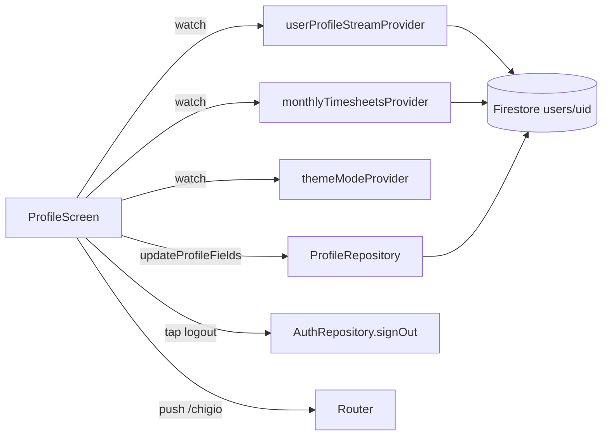

# Feature: Profilo

## Scopo

Mostrare e modificare i dati dell'utente (nome, ente, inquadramento, orario, soglie), statistiche personali del mese corrente, impostazioni app (tema, notifiche, privacy, widget contatori, GPS), statistiche avanzate e logout.

## File coinvolti

| Path | Ruolo |
|---|---|
| `lib/features/profile/presentation/profile_screen.dart` | UI completa |
| `lib/features/profile/presentation/stats_screen.dart` | Schermata statistiche avanzate (`/stats`) |
| `lib/features/profile/data/profile_repository.dart` | `userProfileStreamProvider`, `updateProfileFields`, `updatePhoneNumber` |
| `lib/shared/providers/global_providers.dart` | `themeModeProvider` (`Notifier<ThemeMode>`) |
| `lib/features/authentication/data/auth_repository.dart` | `signOut()` |
| `lib/shared/widgets/monthly_summary_card.dart` | `MonthlySummaryCard.defaultItems` usato nel customizer e in `StatsScreen` |
| `lib/core/services/geofencing_service.dart` | `GeofencingService` — permessi, check posizione, Haversine |
| `lib/core/constants/app_strings.dart` | Tutte le stringhe UI |
| `lib/core/constants/pcm_locations.dart` | Elenco sedi/strutture PCM |
| `lib/core/data/pcm_locations_repository.dart` | Lettura sedi PCM da Drift/fallback seed |
| `docs/ccnl/ccnl-pcm-2019-2021.md` + `docs/ccnl/ccnl-pcm-2016-2018.md` | Asset Markdown letti dal viewer CCNL |

## Routing

`/profile` — rotta push sopra la shell (`parentNavigatorKey: _rootNavigatorKey`), no bottom nav. Accesso da `GlassHeader` (tap avatar) nella dashboard.

## Sezioni UI

### 1. Avatar card

- Avatar (foto Google) o `_InitialAvatar` con iniziale.
- Nome, `employmentType · administration`.
- "Timbratonaut 🚀 dal DD mmm YYYY" (data creazione account da `FirebaseAuth.instance.currentUser?.metadata.creationTime`).
- **Statistiche personali mese corrente** (2×2 grid):

| Stat | Calcolo |
|---|---|
| Record gg | `max(entry.netWorkedMins)` formattato `Xh YYm` |
| Uscita tardiva | `max(entry.endTime)` formattato `HH:MM` |
| Uscita rapida | `min(entry.endTime)` formattato `HH:MM` |
| Smart W. | `count(entry.isRemote)` |

### 2. Dati profilo (tutti editabili — ordine di visualizzazione)

| Ordine | Campo | Widget edit | Firestore key |
|---|---|---|---|
| 1 | Nome completo | `_editTextField` | `name` |
| 2 | Ente | `_editEnteList` | `administration` |
| 3 | Dipartimento | `_editPcmStructureList` | `dipartimento` + dati sede collegati |
| 4 | Sede | `_editPcmSiteList` | `sede`, `sedeId`, `sedeAddress`, `sedeLat`, `sedeLng` |
| 5 | Piano | `_editTextField` | `piano` |
| 6 | Stanza/Ufficio | `_editTextField` | `stanza` |
| 7 | Interno ☎️ | `_editTextField` (numerico) | `interno` |
| 8 | Telefono 📱 | `_editPhone` | `phoneNumber` |
| 9 | Inquadramento | `_editEmploymentType` (chip) | `employmentType` |
| 10 | Orario standard | `_editStandardHoursPresets` (chip preset) | `standardDailyMins` |
| 11 | Soglia buono pasto | `_editSlider` (240–480 min) | `mealVoucherThresholdMins` |
| 12 | Articolo 9 mensile | `_editIntHours` (+/− + slider, 0–50 h) | `monthlyArt9Hours` |
| 13 | Tetto straordinari | `_editIntHours` (+/− + slider, 0–80 h) | `monthlyOvertimeHours` |

#### `_editPcmStructureList` / `_editPcmSiteList`

La sede non è più un campo libero quando l'elenco PCM è disponibile.
La sheet carica `pcmOfficeLocationsProvider`, mostra struttura + sede +
indirizzo, e salva:

- `dipartimento`
- `sede`
- `sedeId`
- `sedeAddress`
- `sedeLat`
- `sedeLng`

Se il DB locale non è disponibile, il repository usa i seed statici in
`pcmOfficeSeeds`.

#### `_editEnteList`

Lista `AppStrings.administrations` (25 enti PA). **Solo "Presidenza del Consiglio dei Ministri" è attiva**; gli altri sono opacizzati al 38% con label "Prossimamente" e non toccabili.

#### `_editStandardHoursPresets`

Sostituisce il vecchio slider `_editSlider` per `standardDailyMins`. Mostra chip preset in base a `employmentType`:
- **Ruolo**: 7:36 (456 min) / 6:40 (400 min)
- **Comando**: 7:12 (432 min) / 6:12 (372 min)

#### `_editEmploymentType`

Chip: Ruolo / Comando / Altro. Al cambio tipo imposta valori default:
- Ruolo → `standardDailyMins=456`, `mealVoucherThresholdMins=380`, `monthlyArt9Hours=8`
- Comando → `standardDailyMins=432`, `mealVoucherThresholdMins=380`, `monthlyArt9Hours=17`

### 3. Impostazioni

| Voce | Azione |
|---|---|
| Tema 🎨 | Picker 4 stati: ☀️ Chiaro / 🌙 Scuro / 📱 Sistema / ⏰ Auto (dark 18:00–06:00) |
| Lingua 🌐 | Toggle 🇮🇹 / 🇬🇧 |
| Dati portale PA 🏦 | `showPortaleEdit` — form ~30 campi totalizzatori |
| Widget contatori 📊 | `showCountersCustomizer` — scelta voci e barre avanzamento |
| Widget e visibilità 🧩 | **Sezione dedicata** con tre pannelli separati (S-19, rollback dello sheet unico che dava errore): Widget Home (`showHomeWidgetsPanel` — ordine + checkbox + ★ evidenza), Schede navbar (`_showNavViewsPanel`), Statistica in evidenza (`_showStatHighlightPanel`) |
| Notifiche 🔔 | `_showNotifiche` — toggle entrata/uscita/report, soglia push uscita prevista, DND, colleghi mattina, recap settimanale, avviso soglia OT, **Stipendio in arrivo** (toggle + giorno accredito 1–28, salva `notifyPayday`/`paydayDay`; push gestito da `hourlyNotifications`, vedi [stipendio](./stipendio.md)) |
| Privacy 🔒 | Sheet informativo |
| Informazioni app ℹ️ | Dialog info + autore |
| CCNL PCM 📘 | Lettore completo 2019-2021 / 2016-2018 con indice articoli |
| Chigio 🐢 | `context.push('/chigio')` |

#### Widget contatori (`_CountersCustomizerSheet`)

Scelta voci visibili nel widget blu mensile + toggle barre avanzamento. Salva `summaryItems: List<String>` e `summaryShowProgress: bool` su Firestore.

Voci: `art9`, `sli`, `sbo`, `op`.

#### Widget e visibilità (sezione dedicata, tre pannelli)

Sezione "WIDGET E VISIBILITÀ" con tre voci, ognuna apre il **proprio** sheet
(lo sheet unico del 2026-07-04 dava errore di caricamento → ripristinati
pannelli separati):

1. **Widget Home** (`showHomeWidgetsPanel`, pubblico — riusato dalla CTA
   "Aggiungi widget" della Home) — lista riordinabile (drag) con checkbox
   visibilità e toggle **★ evidenza**. Salva `homeWidgetsOrder`,
   `hiddenHomeWidgets`, `featuredHomeWidgets`. Un widget in evidenza viene
   renderizzato dalla Dashboard dentro `_FeaturedWidget`: sfondo gradiente blu
   (blue600→800) e `Theme` dark forzato.
2. **Schede navbar** (`_showNavViewsPanel`) — switch per
   home/timesheet/projects/social/salary (`hiddenNavViews`, almeno una scheda
   sempre attiva).
3. **Statistica in evidenza** (`_showStatHighlightPanel`) — chip
   `none/bankHours/overtime/mealCount` (`highlightWidget`), banner in `/stats`.

Ogni widget Home ha un header uniforme `HomeWidgetHeader` con **mini-Chigio**
contestuale (caffè preferiti, corre maggior presenza, calcolatrice contatori,
festeggia banca ore/stipendio, lista totalizzatori, cammina spostamenti,
orologio tabella orari, timer Pomodoro).

### 4. Logout

`AuthRepository.signOut()` → `context.go('/login')`.

### CCNL PCM

La card `_CcnlProfileCard` apre `_CcnlReaderSheet`, un viewer full-screen che
legge i Markdown inclusi negli asset Flutter:

- `docs/ccnl/ccnl-pcm-2019-2021.md` — etichetta "Nuovo".
- `docs/ccnl/ccnl-pcm-2016-2018.md` — etichetta "Precedente".

Il parser interno estrae gli articoli (`Art. N ...`) e costruisce un indice
navigabile. Leggibilità (2026-07-04):

- **premessa** ripulita da indice con puntini, firme e blocco indirizzo
  (`cleanCcnlPreamble`), tipografia normale (niente monospace);
- **corpo articolo** reso capoverso per capoverso: numero di comma in blu
  bold, lettere `a)`/`b)` indentate (`formatCcnlBody` + blocchi stilizzati);
- **indice** con campo di **ricerca** per numero o titolo; righe custom
  `AppTappable` (il vecchio `ListTile` su sheet trasparente causava il
  warning "ink splashes may be invisible").

Il viewer serve per consultazione personale: non crea richieste, workflow
autorizzativi o scadenze.

### Andamento straordinario (`/sau`)

SAU = **Straordinario Autorizzato mensile** = SLI + SBO. `SauScreen` (route
`/sau`, link **sotto lo Storico inquadramenti** nella card Inquadramento):
spiega la registrazione mese-per-mese (`users/{uid}/sau_monthly`), grafico a
barre impilate SLI+SBO degli ultimi 12 mesi e **storico variazioni** — mesi
consecutivi con lo stesso valore raggruppati in range (valore, da mese, a
mese; l'ultimo è "in corso"). In fondo, il marker **entrata in servizio**
registrato in automatico dalla `hireDate` del profilo.

> Note (S-19):
> - **Inquadramento e orario** (con la riga "Registra SAU per <mese esteso>")
>   vive in **Dati personali** (`/profile/edit`, `_InquadramentoCard`).
>   Lo **Storico inquadramenti** mostra ora anche lo **storico orario**
>   (variante schedule per periodo).
> - **Data presa servizio** (`hireDate`, mai nel futuro): campo in Dati
>   personali e onboarding.
> - **Stato del giorno** è un chip nella card personale (fuori da Dati
>   personali) con **scadenza** opzionale (`statusMessageUntil`): 1h / 4h /
>   fine giornata / senza. Sheet condiviso `showStatusMessageSheet`; i
>   colleghi mostrano solo lo stato non scaduto (`activeStatusMessage`).
> - "Scarica i tuoi dati" sta nella card Info app, accanto a Privacy.

## Flusso dati

## Note

- `_editIntHours` mostra un numero grande (48px) + bottoni +/− + slider; salva come `int` (ore).
- `_editEnteList`: solo PCM abilitato; gli altri enti sono disabilitati con trasparenza 38%.
- `_editStandardHoursPresets`: chip visivi grandi (28px), selezione in memoria + `_SaveButton` esplicito.
- `themeModeProvider` è persistito su `SharedPreferences` tramite `global_providers.dart`.

## Schermata Statistiche avanzate (`/stats`)

Rotta push sopra la shell, accessibile dal link "Statistiche avanzate →" in fondo alla avatar card del profilo.

### Sezioni

| Sezione | Dati | Chart |
|---|---|---|
| Contatori mese corrente | `MonthlySummaryCard` non-navigabile | — |
| Widget in evidenza | Valore scelto in preferenze | Colored banner |
| Media ore giornaliere | `avgDailyMins` per gli ultimi 6 mesi | BarChart blu |
| Straordinari per giorno settimana | OT aggregato Lun–Ven, ultimi 3 mesi | BarChart arancione |
| Permessi e ferie | `leaveDays` + `holidayDays` per mese, 6 mesi | Grouped BarChart |
| Orario medio entrata | `avgEntryTime` per mese + giorni presenza | Tabella |
| Statistiche personali avanzate | record streak, pausa media, puntualità ±15 min | Pill metriche |

Tutti i dati vengono da `monthlyTimesheetsProvider` watchato per i 6 mesi precedenti. La classe `_MonthStats` aggrega i calcoli.

## GPS auto-timbratura (`_GpsSettingsCard`)

Sezione GlassCard tra "Dati profilo" e "Impostazioni". Campi Firestore gestiti: `gpsAutoClockIn`, `officeLat`, `officeLng`, `officeRadiusM`.

### Flusso impostazione

1. Utente abilita toggle "Auto-timbratura GPS".
2. Se `officeLat` è null → apre `_GpsSettingsSheet` prima di salvare.
3. `_GpsSettingsSheet`: bottone "Usa posizione attuale" → `GeofencingService.getCurrentPosition()` → salva lat/lng. Slider raggio 50–500m (default 150m).

### Flusso utilizzo (Dashboard)

1. `_GpsPromptCard` appare nella heroCard quando: turno non iniziato + `gpsAutoClockIn` + posizione impostata + ora 06:00–11:00.
2. Utente tap → `GeofencingService.checkInOffice()` → se `inside` → dialog conferma → `notifier.startTurn()`.
3. Prompt si auto-chiude dopo il check (dismissed) o se l'utente chiude la ×.

Vedi **ADR-0004** per la scelta `geolocator` foreground vs. background.

_Ultima revisione: 2026-07-05 (S-19) — Widget e visibilità in sezione dedicata a tre pannelli, Data presa servizio, stato del giorno con scadenza fuori da Dati personali, SAU con storico orario + marker presa servizio, header widget uniformi._
