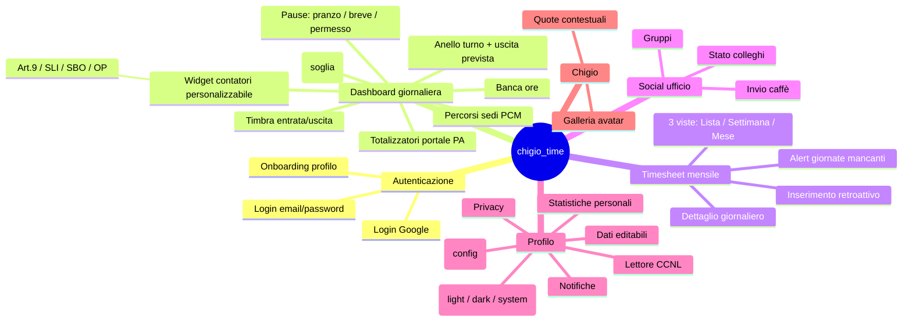

# Overview di `chigio_time`

## Vision

`chigio_time` e' un'app di **time tracking per dipendenti pubblici**
(in particolare in amministrazioni come la Presidenza del Consiglio dei
Ministri, default presente nel codice). L'obiettivo e' rendere semplice e
trasparente la gestione quotidiana di:

- timbrature di entrata e uscita;
- pause (pranzo, brevi, permessi);
- straordinari e regola delle "9 ore" (decurtazione d'ufficio della pausa
  pranzo se non effettuata);
- buoni pasto maturati;
- monte ore mensile, permessi brevi, banca ore, straordinari mensili.

L'app e' multi-piattaforma (Flutter) con sincronizzazione cloud
(Firebase) e una vista "social" che mostra lo stato dei colleghi in
ufficio o in smart working.

## Persona di riferimento

> "Marco, dipendente PA, vuole vedere a colpo d'occhio quante ore ha
> lavorato oggi, quando puo' uscire, se ha maturato il buono pasto, e
> quanto straordinario sta accumulando nel mese."

## Mappa funzionale a un colpo d'occhio

## Stato attuale

Lo stato corrente (cosa è implementato vs cosa è mockato) è tracciato
nelle schede [`docs/funzionalita/*.md`](../funzionalita/README.md). In sintesi:

| Feature | Stato |
|---|---|
| Autenticazione (Google Sign-In + email/password) | ✅ implementata |
| Onboarding profilo | ✅ implementato |
| Dashboard — cronometro turno | ✅ implementata |
| Dashboard — widget contatori mensili (personalizzabile) | ✅ implementato |
| Dashboard — totalizzatori portale PA | ✅ manuale/Firestore (`portaleJson`; HTTP da cablare) |
| Dashboard — banca ore | ✅ manuale + BOE |
| Dashboard — percorsi sedi PCM | ✅ implementato |
| Timesheet — 3 viste (Lista/Settimana/Mese) | ✅ implementato |
| Timesheet — alert giornate mancanti + assenze classificate | ✅ implementato |
| Social — stato colleghi | ✅ live da Firestore |
| Social — invio caffè + handshake | ✅ implementato (invite + accepted back-notifica) |
| Social — gruppi e filtri | ✅ implementato |
| Profilo — editabile + statistiche + CCNL | ✅ implementato |
| Profilo — notifiche configurabili | ✅ UI + Firestore + FCM |
| Chigio — mascotte e quote header | ✅ implementata |
| Notifiche push (`firebase_messaging`) | ✅ implementate |
| Storage locale Drift | 🟡 implementato; asset WASM web da completare |

## Documenti correlati

- Requisiti dettagliati → [`requirements.md`](./requirements.md)
- Glossario di dominio → [`../glossario.md`](../glossario.md)
- Decisione di stack → [`../decisioni/0001-stack-iniziale.md`](../decisioni/0001-stack-iniziale.md)
