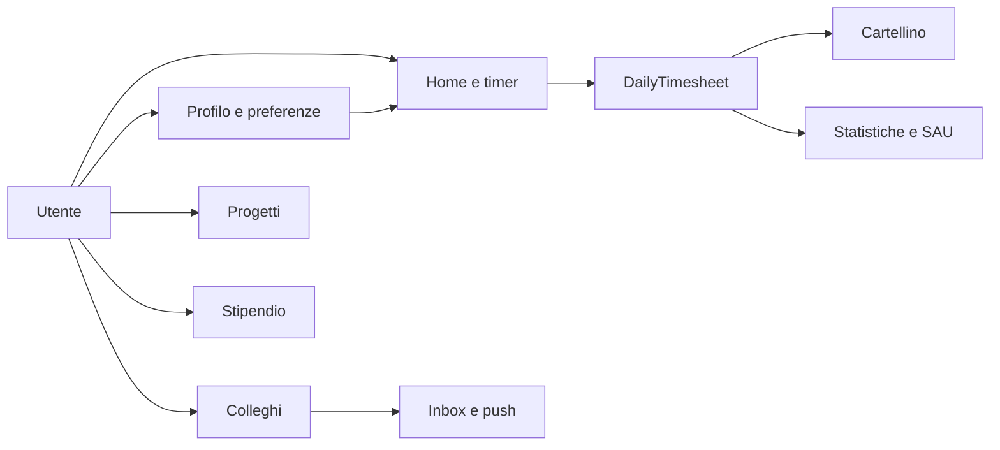

# Panoramica del prodotto

## Problema

Il portale ufficiale delle presenze resta la fonte amministrativa, ma non
risponde rapidamente alle domande quotidiane del dipendente:

- quanto ho lavorato oggi;
- quando posso uscire;
- ho maturato il buono pasto;
- quanto sto accumulando tra maggior presenza, SLI, SBO e deficit;
- il cartellino personale è coerente con quanto ricordo.

Chigio Time fornisce queste risposte in un registro personale, sincronizzato e
utilizzabile da più dispositivi.

## Utenti

Il prodotto è destinato a Marco e a una cerchia ristretta di colleghi PCM.
L’uso è frequente, spesso da mobile in movimento e da Web in ufficio. Gli
utenti conoscono la terminologia del dominio e privilegiano precisione,
leggibilità e rapidità rispetto a onboarding promozionali.

## Confini

Chigio Time:

- calcola e registra dati personali;
- importa ed esporta informazioni;
- mostra stime e scostamenti;
- facilita la comunicazione informale tra colleghi.

Chigio Time non:

- timbra sul sistema ufficiale;
- autorizza ferie, permessi o straordinari;
- certifica cedolini o residui;
- sostituisce il portale HR;
- offre un pannello di supervisione manageriale.

## Struttura dell’app

Le cinque sezioni principali sono:

1. **Home** — turno corrente, uscita prevista e widget personali.
2. **Cartellino** — viste Giorno, Lista, Settimana, Mese e Anno.
3. **Progetti** — progetti personali o condivisi e timer Pomodoro.
4. **Colleghi** — stato, gruppi, contatti e inviti caffè.
5. **Stipendio** — prossimo accredito e storico personale.

Profilo, notifiche, statistiche, SAU e galleria Chigio sono route secondarie
sopra la shell principale.

```mermaid
flowchart LR
    U[Utente] --> H[Home e timer]
    H --> T[DailyTimesheet]
    T --> C[Cartellino]
    T --> S[Statistiche e SAU]
    U --> P[Profilo e preferenze]
    P --> H
    U --> O[Colleghi]
    O --> N[Inbox e push]
    U --> R[Progetti]
    U --> L[Stipendio]
```

## Principi di prodotto

1. **Risposta in un colpo d’occhio.**
2. **Dati prima degli effetti grafici.**
3. **Terminologia CCNL precisa.**
4. **Errori espliciti: errore, caricamento e stato vuoto non sono equivalenti.**
5. **Offline utile senza inventare dati autorevoli.**
6. **Delight concentrato nei momenti giusti, tramite Chigio.**

## Stato

La versione documentata è `2026.7.22+22`. Il client Web è pubblicato su
`chigiotime.web.app`. Funzionalità e infrastruttura sono implementate; i limiti
aperti sono raccolti nella [Roadmap](../ROADMAP.md) e nelle singole pagine.

## Prossime letture

- [Guida utente](./guida-utente.md)
- [Requisiti](./requirements.md)
- [Architettura](../architettura/README.md)
- [Mappa delle feature](../funzionalita/README.md)

_Ultima revisione: 2026-07-29 — allineata alla versione 2026.7.22+22._
